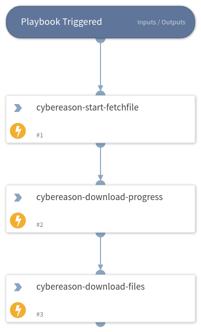

This playbook downloads a file from Cybereason platform, based on the Malop ID and username provided.

## Dependencies
This playbook uses the following sub-playbooks, integrations, and scripts.

### Sub-playbooks
This playbook does not use any sub-playbooks.

### Integrations
Cybereason

### Scripts
This playbook does not use any scripts.

### Commands
* cybereason-start-fetchfile
* cybereason-fetchfile-progress
* cybereason-download-file

## Playbook Inputs
---

| **Name** | **Description** | **Default Value** | **Required** |
| --- | --- | --- | --- |
| malopGUID, userName | Malop GUID for fetching a file from a sonsor to download, The complete Cybereason user name string for the user performing the request |  | Optional |

## Playbook Image
---

