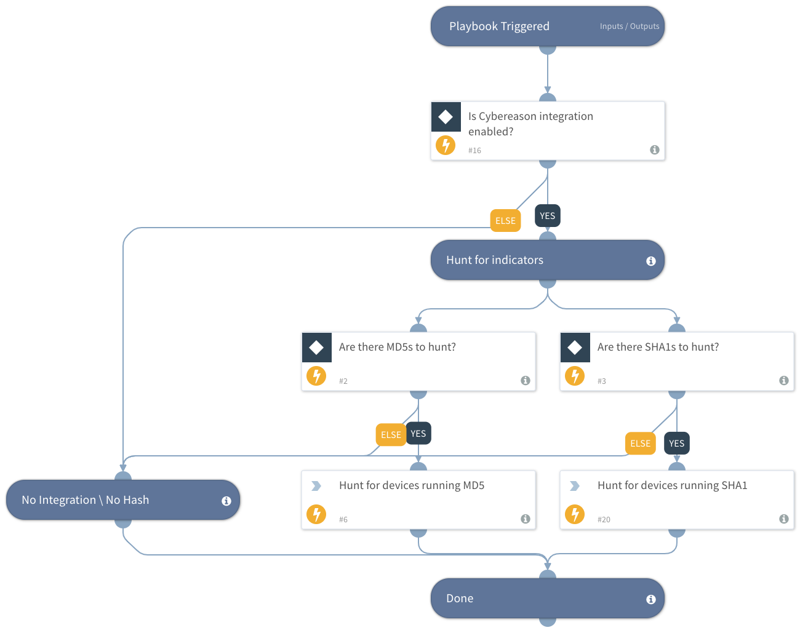

Hunt for endpoint activity involving hash, using Cybereason.

## Dependencies
This playbook uses the following sub-playbooks, integrations, and scripts.

### Sub-playbooks
This playbook does not use any sub-playbooks.

### Integrations
* Cybereason

### Scripts
This playbook does not use any scripts.

### Commands
* cybereason-query-file

## Playbook Inputs
---

| **Name** | **Description** | **Default Value** | **Source** | **Required** |
| --- | --- | --- | --- | --- |
| MD5Hash | MD5 Hash | MD5 | File | Optional |
| SHA1Hash | SHA1 Hash | SHA1 | File | Optional |

## Playbook Outputs
---

| **Path** | **Description** | **Type** |
| --- | --- | --- |
| Endpoint.Hostname | Device hostname | string |
| Endpoint | The endpoint | unknown |

## Playbook Image
---

