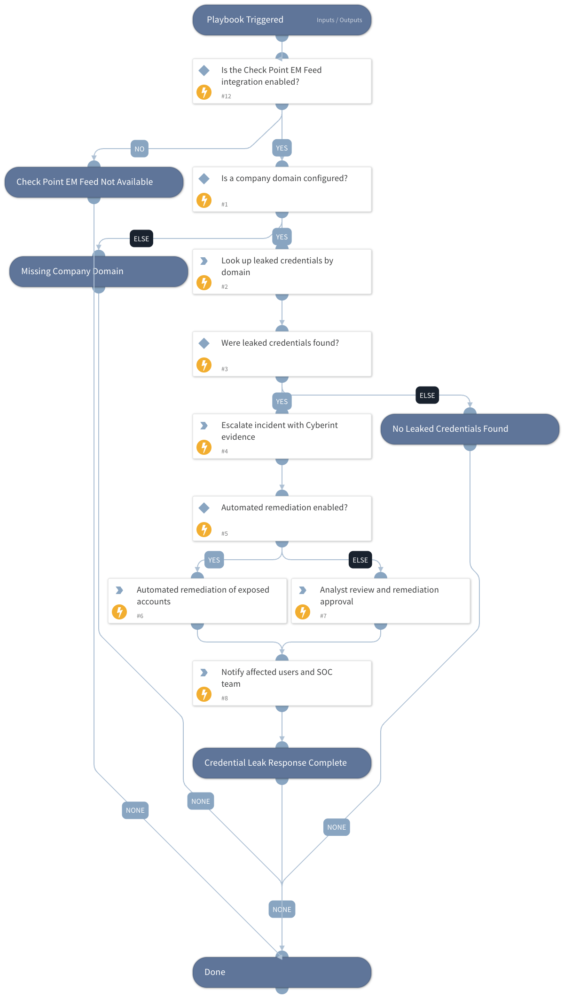

Validates and responds to leaked employee or customer credentials reported by Cyberint Argos.

The playbook looks up leaked credentials for the configured company domain, escalates the incident when exposed credentials are found, and drives an automated or semi-automated remediation flow (reset sessions, force password reset, or disable the account in the identity provider), followed by user and SOC notification.

Identity-provider validation and remediation steps are modeled as manual tasks so the playbook works out of the box; connect them to your Active Directory, Microsoft Entra ID or Okta integration to fully automate the response.

## Dependencies

This playbook uses the following sub-playbooks, integrations, and scripts.

### Sub-playbooks

This playbook does not use any sub-playbooks.

### Integrations

* Check Point EM Feed

### Scripts

This playbook does not use any scripts.

### Commands

* cyberint-credential-leak-lookup
* setIncident

## Playbook Inputs

---

| **Name** | **Description** | **Default Value** | **Required** |
| --- | --- | --- | --- |
| CompanyDomain | The company domain to look up leaked credentials for (for example, example.com). |  | Required |
| LastSeenFrom | Only validate credentials last seen on or after this ISO-formatted date (YYYY-MM-DDTHH:MM:SSZ). Use this when running the playbook on a recurring schedule to process only newly leaked credentials. |  | Optional |
| Limit | Maximum number of leaked credential records to retrieve. |  | Optional |
| AutoRemediate | Whether to remediate exposed accounts automatically (yes) or to require analyst review and approval first (no). Default is no. | no | Optional |

## Playbook Outputs

---

| **Path** | **Description** | **Type** |
| --- | --- | --- |
| Cyberint.LeakedCredential | The leaked credentials returned by the Cyberint lookup, split into employee and customer records, each with username, exposure entries and first/last-seen dates. | unknown |

## Playbook Image

---

