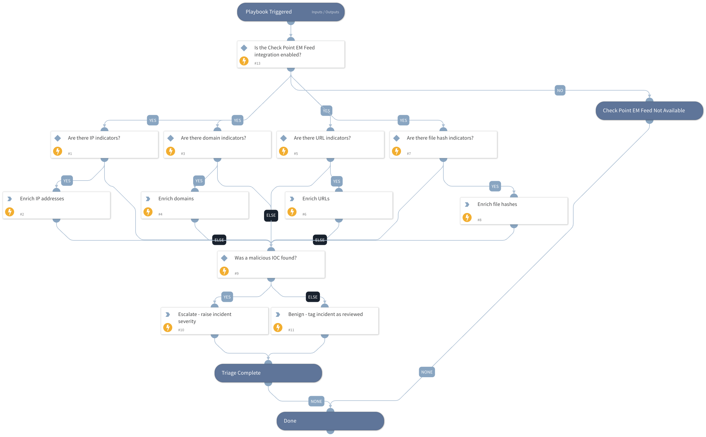

Enriches IOC entities (IP, domain, URL, file hash) found in an incident with Cyberint threat intelligence, then applies triage decision logic.

The playbook routes each indicator to the matching Cyberint IOC enrichment endpoint, appends the returned maliciousness score and detected activities to the incident, and escalates the incident severity when a malicious indicator is found.

Requires the Check Point EM Feed (Cyberint Feed) integration to be configured.

## Dependencies

This playbook uses the following sub-playbooks, integrations, and scripts.

### Sub-playbooks

This playbook does not use any sub-playbooks.

### Integrations

* Check Point EM Feed

### Scripts

This playbook does not use any scripts.

### Commands

* cyberint-get-ipv4
* cyberint-get-domain
* cyberint-get-url
* cyberint-get-file-sha256
* setIncident

## Playbook Inputs

---

| **Name** | **Description** | **Default Value** | **Required** |
| --- | --- | --- | --- |
| IP | IP address indicators to enrich with Cyberint threat intelligence. Defaults to IP indicators extracted from the incident. | IP.Address | Optional |
| Domain | Domain indicators to enrich with Cyberint threat intelligence. Defaults to domain indicators extracted from the incident. | Domain.Name | Optional |
| URL | URL indicators to enrich with Cyberint threat intelligence. Defaults to URL indicators extracted from the incident. | URL.Data | Optional |
| FileSHA256 | SHA256 file hash indicators to enrich with Cyberint threat intelligence. Defaults to file hashes extracted from the incident. | File.SHA256 | Optional |
| MaliciousScoreThreshold | The Cyberint maliciousness score (0-100) at or above which an indicator is treated as malicious and the incident is escalated. Default is 50. | 50 | Optional |

## Playbook Outputs

---

| **Path** | **Description** | **Type** |
| --- | --- | --- |
| Cyberint.ipv4 | Cyberint IP address IOC enrichment results, including maliciousness score, detected activities and benign verdict. | unknown |
| Cyberint.domain | Cyberint domain IOC enrichment results, including maliciousness score, detected activities and benign verdict. | unknown |
| Cyberint.url | Cyberint URL IOC enrichment results, including maliciousness score, detected activities and benign verdict. | unknown |
| Cyberint.file_sha256 | Cyberint file hash IOC enrichment results, including maliciousness score, detected activities and benign verdict. | unknown |

## Playbook Image

---

