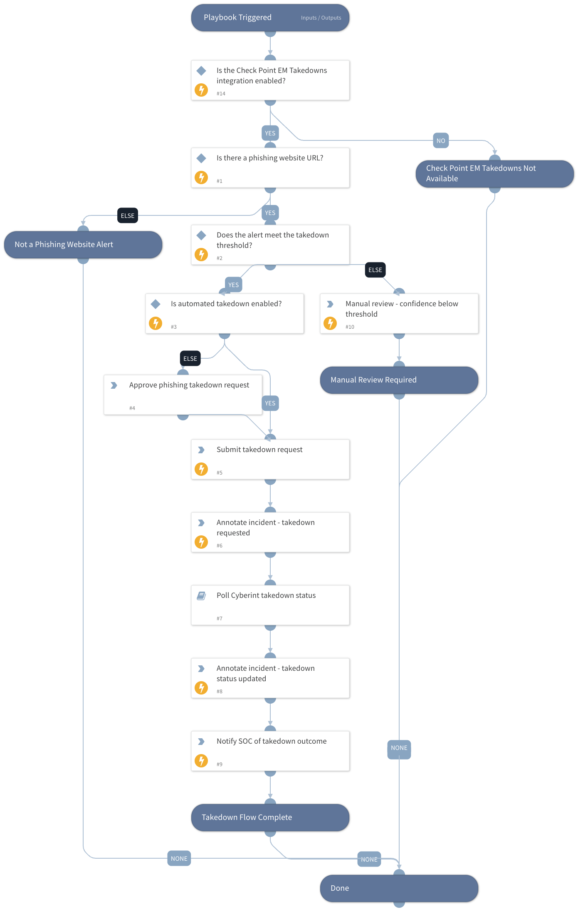

Automates or semi-automates the takedown of high-confidence phishing websites detected by Cyberint.

The playbook evaluates the confidence and severity of a Cyberint phishing-website alert, submits a takedown request via the Cyberint Takedown API (automatically or after analyst approval), polls the takedown request until it reaches a terminal status, and annotates the incident and notifies the SOC of the outcome.

Requires the Cyberint Takedown integration to be configured.

## Dependencies

This playbook uses the following sub-playbooks, integrations, and scripts.

### Sub-playbooks

* GenericPolling

### Integrations

* Check Point EM Takedowns

### Scripts

This playbook does not use any scripts.

### Commands

* cyberint-takedown-url
* cyberint-retrieve-takedowns
* setIncident

## Playbook Inputs

---

| **Name** | **Description** | **Default Value** | **Required** |
| --- | --- | --- | --- |
| URL | The phishing website URL to submit for takedown. Defaults to the URL from the Cyberint alert data. | ${incident.cyberintalerturl} | Optional |
| CustomerID | The Cyberint customer ID, as configured in the Cyberint integration. Used to submit and track the takedown request. |  | Required |
| Reason | The takedown reason. One of: phishing, brand_abuse, impersonating_application, unofficial_application_distribution, malicious_content, social_media_impersonation, social_media_employee_impersonation, fake_job_post, sensitive_file_on_antivirus_repository, instant_messaging_impersonation, other. Default is phishing. | phishing | Optional |
| AlertID | The Cyberint alert ID associated with the phishing website. Used to correlate the takedown request with the alert. | ${incident.alertid} | Optional |
| Brand | The brand the phishing website is impersonating. Required by the takedown API to determine the original \(legitimate\) URL when the customer profile does not resolve it automatically. Defaults to the Cyberint alert targeted brand. | ${incident.cyberinttargetedbrand} | Optional |
| OriginalURL | The URL of the original, legitimate content being impersonated. Required by the takedown API to determine the original URL when the customer profile does not resolve it automatically. |  | Optional |
| Confidence | The confidence score (0-100) of the phishing website alert. Defaults to the Cyberint alert confidence field. | ${incident.cyberintconfidence} | Optional |
| ConfidenceThreshold | The minimum confidence score (0-100) required to initiate a takedown. Default is 80. | 80 | Optional |
| Severity | The severity of the incident (1-Low, 2-Medium, 3-High, 4-Critical). Defaults to the incident severity. | ${incident.severity} | Optional |
| MinSeverity | The minimum incident severity (1-4) required to initiate a takedown. Default is 3 (High). | 3 | Optional |
| AutoTakedown | Whether to submit the takedown request automatically (yes) or to require analyst approval first (no). Default is no. | no | Optional |
| PollingInterval | How often, in minutes, to poll the Cyberint takedown request status. Default is 5. | 5 | Optional |
| PollingTimeout | How long, in minutes, to keep polling the takedown request status before timing out. Default is 1440 (24 hours). | 1440 | Optional |

## Playbook Outputs

---

| **Path** | **Description** | **Type** |
| --- | --- | --- |
| Cyberint.takedowns_submit | The submitted Cyberint takedown request. | unknown |
| Cyberint.takedowns_list | The polled Cyberint takedown request, including its current status. | unknown |

## Playbook Image

---

