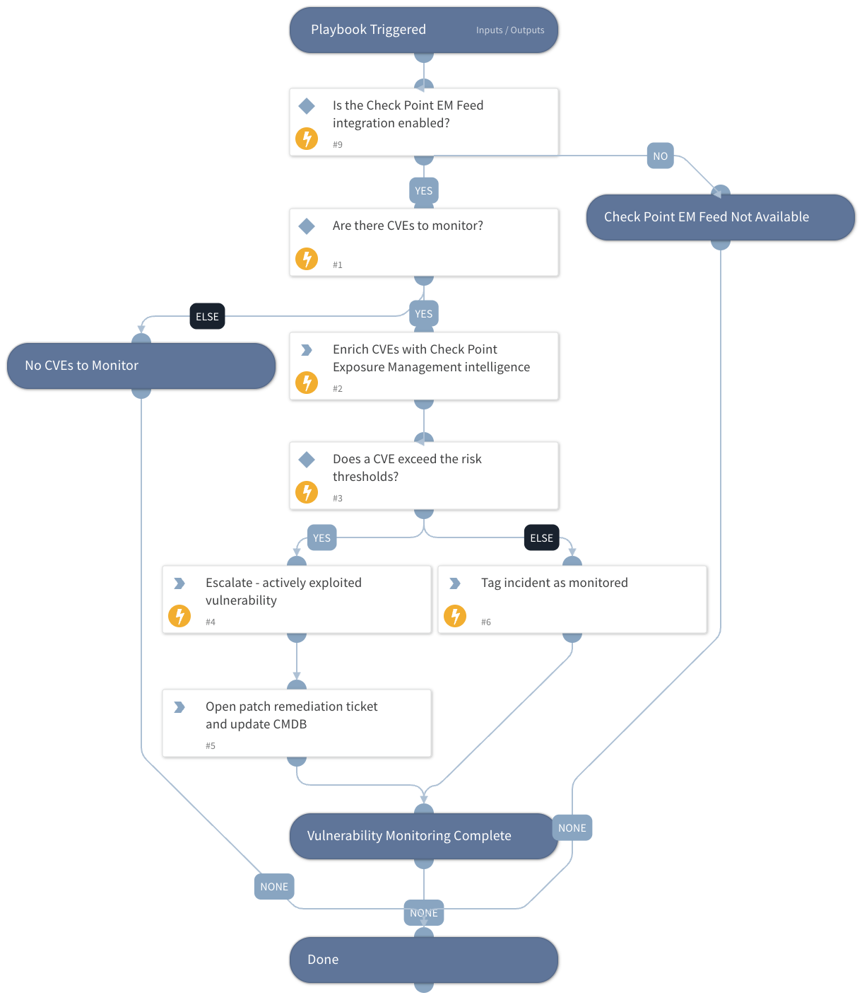

Enriches CVEs from a vulnerability-management incident with Cyberint vulnerability intelligence and prioritizes them based on real-world exploitation.

For each CVE the playbook retrieves the Cyberint CVE score, CVSS, EPSS, CWE and active-exploitation evidence. When a CVE exceeds the configured risk thresholds or is being actively exploited, the incident is escalated and a patch-remediation ticket is opened; otherwise the CVE is tagged as monitored.

Connect the remediation task to your ticketing system and CMDB to fully automate risk-based vulnerability management.

## Dependencies

This playbook uses the following sub-playbooks, integrations, and scripts.

### Sub-playbooks

This playbook does not use any sub-playbooks.

### Integrations

* Check Point EM Feed

### Scripts

This playbook does not use any scripts.

### Commands

* cyberint-cve-enrich
* setIncident

## Playbook Inputs

---

| **Name** | **Description** | **Default Value** | **Required** |
| --- | --- | --- | --- |
| CVE | CVE identifiers to monitor. Defaults to CVE indicators extracted from the incident. | CVE.ID | Optional |
| CyberintScoreThreshold | The Cyberint CVE score (0-10) at or above which the incident is escalated. Default is 7. | 7 | Optional |
| CVSSThreshold | The CVSS base score (0-10) at or above which the incident is escalated. Default is 7. | 7 | Optional |
| EPSSThreshold | The EPSS probability score (0-1) at or above which the incident is escalated. Default is 0.5. | 0.5 | Optional |

## Playbook Outputs

---

| **Path** | **Description** | **Type** |
| --- | --- | --- |
| Cyberint.CVE | The Cyberint CVE intelligence results, including the Cyberint score, CVSS, EPSS, CWE and active-exploitation evidence. | unknown |
| CVE | The CVE indicator objects produced by the enrichment. | unknown |

## Playbook Image

---

