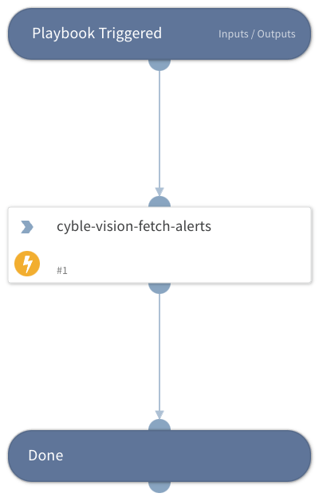

Playbook for Cyble Vision Alert V2.

## Dependencies

This playbook uses the following sub-playbooks, integrations, and scripts.

### Sub-playbooks

This playbook does not use any sub-playbooks.

### Integrations

* cybleeventsv2

### Scripts

This playbook does not use any scripts.

### Commands

* cyble-vision-fetch-alerts

## Playbook Inputs

---

| **Name** | **Description** | **Default Value** | **Required** |
| --- | --- | --- | --- |
| start_date |  | 2023-05-30T00:00:00+00:00 | Required |
| end_date |  | 2023-05-31T00:00:00+00:00 | Required |

## Playbook Outputs

---
There are no outputs for this playbook.

## Playbook Image

---

