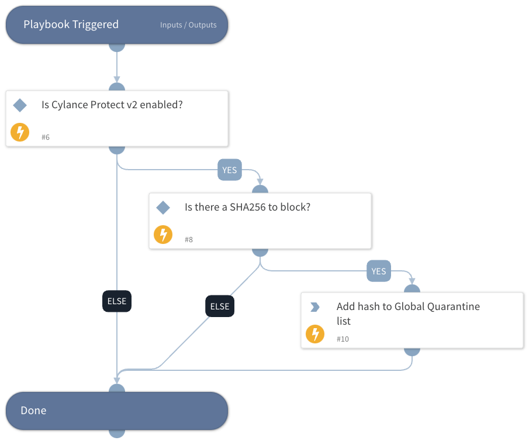

This playbook accepts a SHA256 hash and adds the hash to the Global Quarantine list using the Cylance Protect v2 integration.

## Dependencies

This playbook uses the following sub-playbooks, integrations, and scripts.

### Sub-playbooks

This playbook does not use any sub-playbooks.

### Integrations

* Cylance_Protect_v2

### Scripts

This playbook does not use any scripts.

### Commands

* cylance-protect-add-hash-to-list

## Playbook Inputs

---

| **Name** | **Description** | **Default Value** | **Required** |
| --- | --- | --- | --- |
| SHA256 | The SHA256 hash of the file to block. | File.SHA256 | Optional |
| ListType | The list type to which the threat belongs. Can be "GlobalQuarantine" or "GlobalSafe". | GlobalQuarantine | Optional |

## Playbook Outputs

---

| **Path** | **Description** | **Type** |
| --- | --- | --- |
| CbResponse.BlockedHashes.LastBlock.Time | Last block time. | unknown |
| CbResponse.BlockedHashes.LastBlock.Hostname | Last block hostname. | unknown |
| CbResponse.BlockedHashes.LastBlock.CbSensorID | Last block sensor ID. | unknown |

## Playbook Image

---

