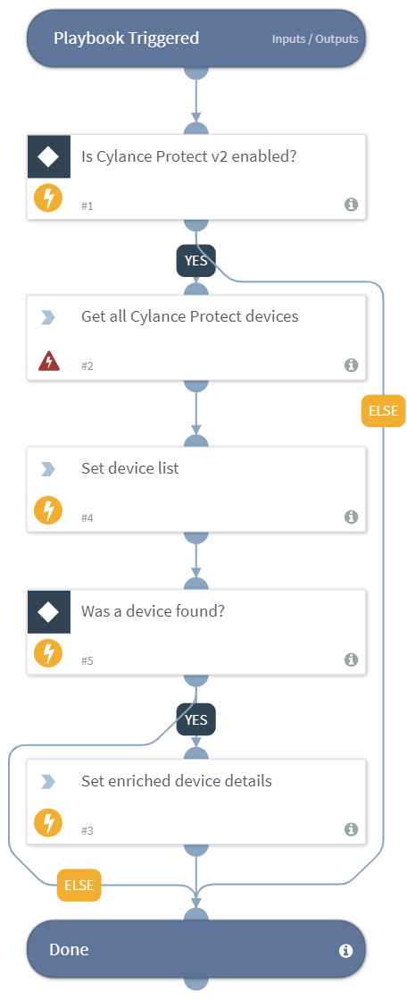

Enriches endpoints using the Cylance Protect v2 integration.

## Dependencies
This playbook uses the following sub-playbooks, integrations, and scripts.

### Sub-playbooks
This playbook does not use any sub-playbooks.

### Integrations
* Cylance Protect v2

### Scripts
* Set

### Commands
* cylance-protect-get-devices

## Playbook Inputs
---

| **Name** | **Description** | **Default Value** | **Source** | **Required** |
| --- | --- | --- | --- | --- |
| Hostname | The hostname to enrich. | None | inputs.Hostname | Optional |

## Playbook Outputs
---

| **Path** | **Description** | **Type** |
| --- | --- | --- |
| CylanceProtectDevice | The device information about the hostname that was enriched. | unknown |

## Playbook Image
---

