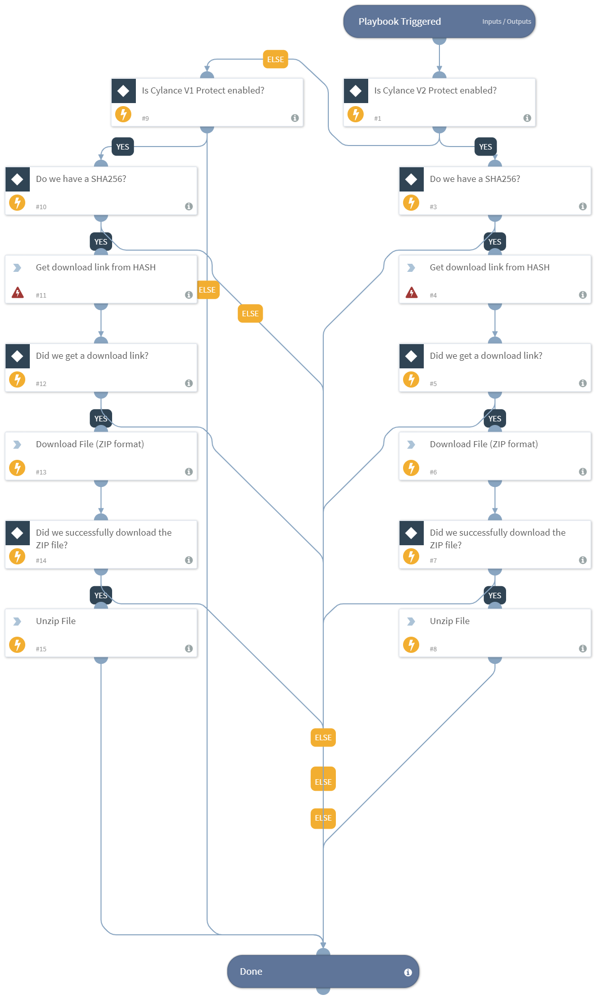

DEPRECATED. Use "Get File Sample By Hash - Cylance Protect v2" playbook instead.

## Dependencies
This playbook uses the following sub-playbooks, integrations, and scripts.

### Sub-playbooks
This playbook does not use any sub-playbooks.

### Integrations
* Cylance Protect v2
* Cylance Protect

### Scripts
* UnzipFile
* Exists
* http

### Commands
* cylance-protect-download-threat

## Playbook Inputs
---

| **Name** | **Description** | **Default Value** | **Source** | **Required** |
| --- | --- | --- | --- | --- |
| SHA256 | The SHA256 hash of the file to download. | SHA256 | File | Optional |
| ZipPassword | The password for the zip file. | infected | - | Required |

## Playbook Outputs
---

| **Path** | **Description** | **Type** |
| --- | --- | --- |
| File | The sample file. | unknown |

## Playbook Image
---
