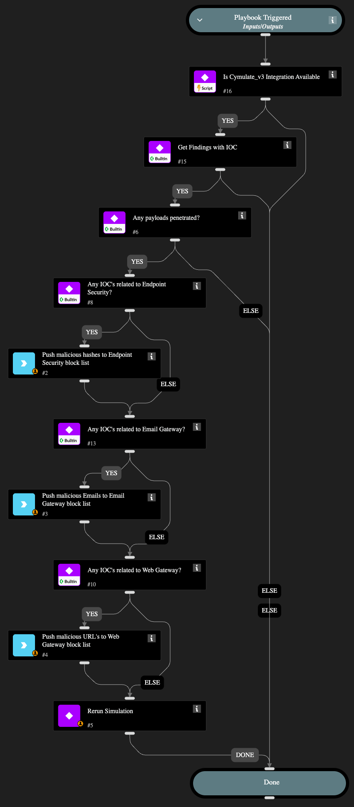

Cymulate IOC Findings Mitigation is a playbook that takes IOC (Indicator of Compromise) findings from the Cymulate Exposure Management platform and automates or guides mitigation actions to update controls and reduce security gaps quickly. It helps turn validated threat indicators into practical response steps within Cortex XSOAR.

## Dependencies

This playbook uses the following sub-playbooks, integrations, and scripts.

### Sub-playbooks

This playbook does not use any sub-playbooks.

### Integrations

This playbook does not use any integrations.

### Scripts

* IsIntegrationAvailable

### Commands

This playbook does not use any commands.

## Playbook Inputs

---
There are no inputs for this playbook.

## Playbook Outputs

---
There are no outputs for this playbook.

## Playbook Image

---

