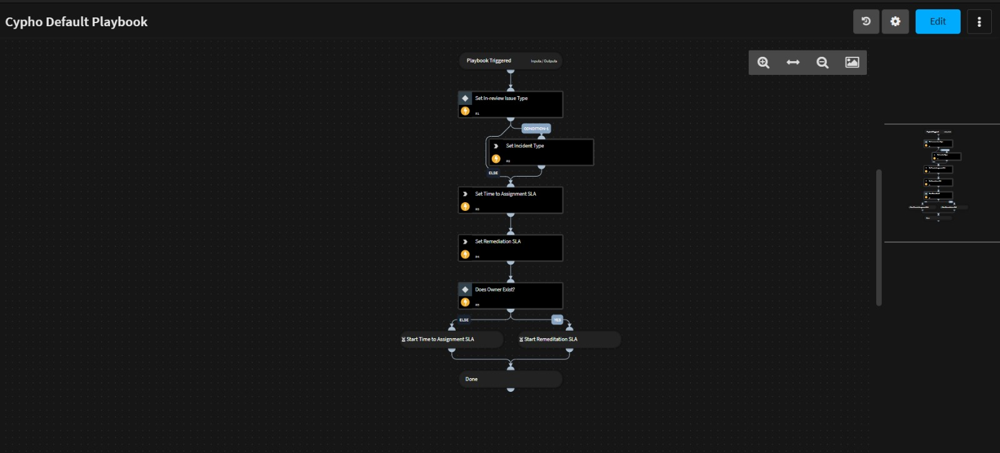

### Silent Cypho Default Playbook

#### Description

The Silent Cypho Default Playbook is designed for use in Cortex XSOAR to silently process incoming Cypho security alerts and maintain incident lifecycle parity. The playbook performs automated classification of issues, assigns SLA tracking for governance metrics, and enforces incident ownership validation to ensure that no automated response actions (approve, dismiss, severity change, comments, or attachment extraction) run without an analyst being assigned first.

It leverages only built-in Condition Tasks and the native `setIncident` command module, ensuring full compatibility with XSOAR Marketplace standards while preserving accurate SOC performance KPIs, including MTTR (Mean Time To Resolve), MTTD (Mean Time To Detect), and owner attribution in the incident timeline. This removes the risk of silent automations overwriting incident responsibility, enables reliable KPI calculations, and reduces manual effort for repeated updates.

---

## Dependencies

This playbook uses the following sub-playbooks, integrations, and scripts.

### Sub-playbooks

This playbook does not use any sub-playbooks.

### Integrations

This playbook does not use any integrations.

### Scripts

This playbook does not use any scripts.

### Commands

* setIncident

## Playbook Inputs

---
There are no inputs for this playbook.

## Playbook Outputs

---
There are no outputs for this playbook.

## Playbook Image

---

