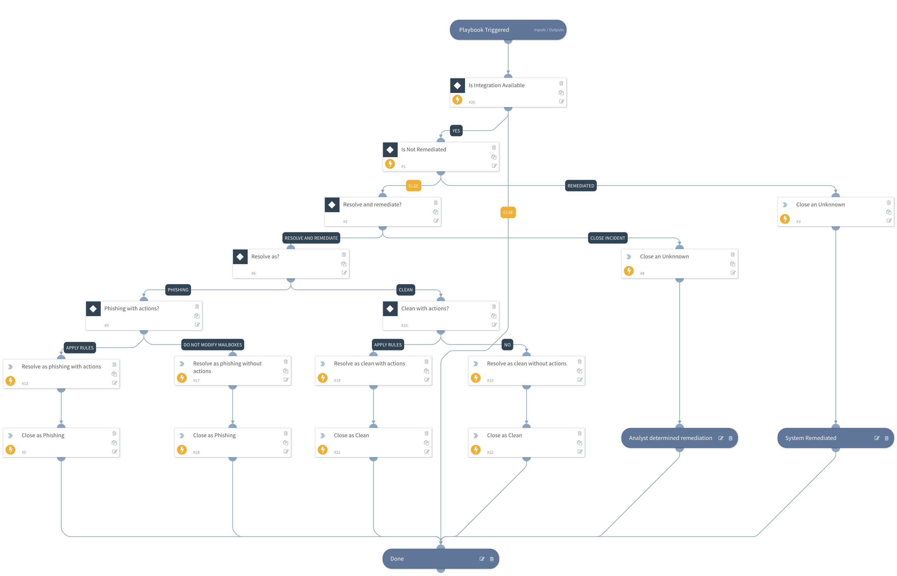

Processes Cyren Incidents, sets resolutions, and applies remediations to end-user mailboxes. 

## Dependencies
This playbook uses the following sub-playbooks, integrations, and scripts.

### Sub-playbooks
This playbook does not use any sub-playbooks.

### Integrations
* CyrenInboxSecurity

### Scripts
* IsIntegrationAvailable

### Commands
* cyren-resolve-and-remediate
* closeInvestigation

## Playbook Inputs
---
There are no inputs for this playbook.

## Playbook Outputs
---
There are no outputs for this playbook.

## Playbook Image
---

