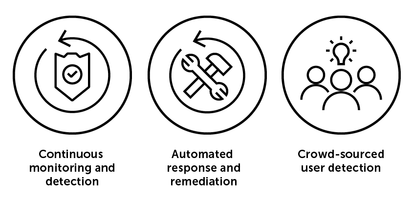
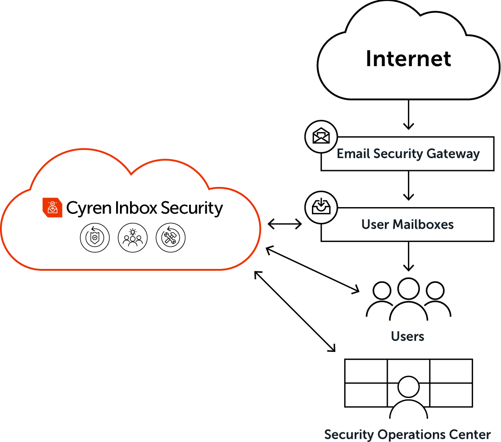

# Cyren Inbox Security

---

*This Content Pack is used to integrate Cyren Inbox Security with XSOAR. You will need a free trial or production license to Cyren Inbox Security to get the full value of this Content Pack*

---

Evasive phishing, BEC and fraud attacks are getting past existing email defenses. The sophistication of these attacks helps them avoid perimeter detection and fool your employees, including those who’ve been through Security Awareness and Training programs.

## What makes Cyren unique

Cyren Inbox Security establishes a continuous, adaptive and automated layer of security right in the user mailbox, where it is needed most. Delivered as a native cloud service, Cyren Inbox Security provides:

- **Continuous Monitoring and Detection**  

Persistent rescanning of inbound, outbound and delivered emails in all folders assures prompt detection of evasive attack indicators, while real-time analysis of user and mailbox behaviors identifies anomalies that point to a possible threat.

- **Automated Response and Remediation**  

Policy-based response framework automates remediation actions in individual mailboxes and across all mailboxes in the organization, while automated incident and case management workflows further reduce investigative overhead and accelerate threat resolution.

- **Crowd-sourced user detection**  

Our seamless mailbox plugin lets users scan and report suspicious emails at will, and automatically close the feedback loop on alerts, which reinforces your security training and provides valuable crowdsourced threat intelligence that is fed back into the system to improve threat detection.

## With Cyren Inbox Security you can

- Shorten SOC time to respond and remediate email-borne threats

- Engage every employee in the fight against cyber threats and reinforce security awareness training

- Reduce cost of threat response and remediation

- Better utilize Cybersecurity skills and resources through automation

- Plug the gap in corporate email security

- Reduce alert fatigue and avoid analyst attrition or unnecessary SOC team expansion

- Protect investments in Secure Email Gateway and other existing solutions

## Help Your Email Security Team Respond Faster, Perform Better

With Cyren Inbox Security, your IT admins and security teams enjoy a complete management dashboard plus robust workflows that simplify incident response and investigation processes, and automate remediation. Security teams no longer have to spend hours manually reviewing and removing malicious emails, as Cyren Inbox Security does the heavy lifting for you with:

- Automatic aggregation of similar incidents into a single case

- Clear and detailed display of threat forensics per incident and case

- Automatic incident investigation and similarity searches

- Automatic remediation of incident or case across all mailboxes

- Automatic remediation of threats detected by 14-day retro scan at time of onboarding

- Simple integration with XSOAR

The [Cyren Inbox Security content pack](#/market/browse/CyrenInboxSecurity) provides tools to import Cyren Incident details into XSOAR.

