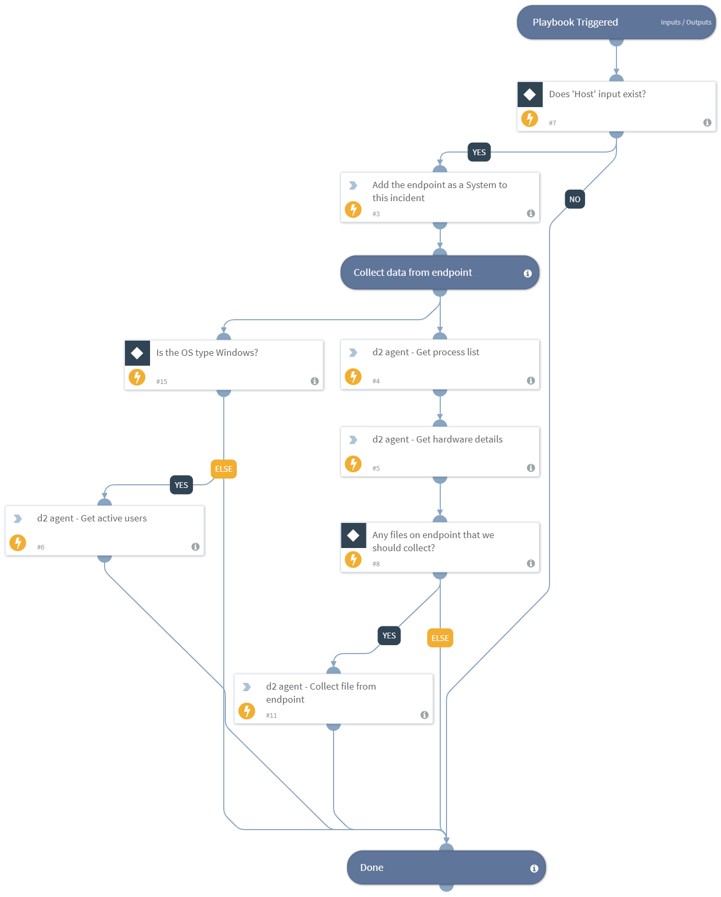

Uses Cortex XSOAR's D2 agent to collect data from an endpoint for IR purposes.

Input:
* Hostname (default: ${Endpoint.Hostname})
* OS (default: windows)
* Credentials (default: Admin)
* Path (default: None)

## Dependencies
This playbook uses the following sub-playbooks, integrations, and scripts.

### Sub-playbooks
This playbook does not use any sub-playbooks.

### Integrations
This playbook does not use any integrations.

### Scripts
* FetchFileD2
* ActiveUsersD2
* AreValuesEqual
* IncidentAddSystem
* D2ExecuteCommand
* Exists

### Commands
This playbook does not use any commands.

## Playbook Inputs
---

| **Name** | **Description** | **Default Value** | **Required** |
| --- | --- | --- | --- | 
| Host | Deploys D2 on a target host. | ${Endpoint.Hostname} |Optional |
| OS | The default OS type of target host. | Windows | Optional |
| Credentials | The name of the credential set from Cortex XSOAR **Settings -> Integrations -> Credentials**. | Admin | Optional |
| Path | If initialized, D2 will try and collect the file at target path. | - | Optional |

## Playbook Outputs
---
There are no outputs for this playbook.

## Playbook Image
---

