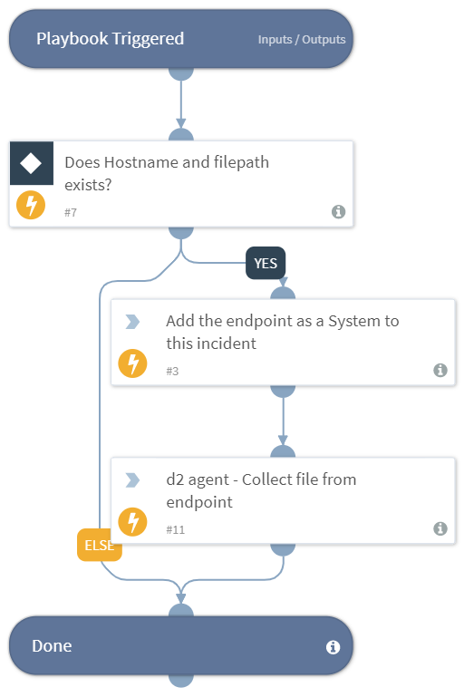

Returns a file sample, to the War Room from a path on an endpoint using Cortex XSOAR Dissolvable Agent (D2).

Input:
* Credentials - The credentials to use when trying to deploy Cortex XSOAR Dissolvable Agent (D2)  (default: Admin).
* ${Endpoint.Hostname} - Deploys an agent on the target endpoint.
* ${File.Path} - The file's path to collect.

## Dependencies
This playbook uses the following sub-playbooks, integrations, and scripts.

### Sub-playbooks
This playbook does not use any sub-playbooks.

### Integrations
This playbook does not use any integrations.

### Scripts
* FetchFileD2
* IncidentAddSystem

### Commands
This playbook does not use any commands.

## Playbook Inputs
---

| **Name** | **Description** | **Default Value** | **Required** |
| --- | --- | --- | --- |
| Credentials | The name of the credential set from Cortex XSOAR **Settings -> Integrations -> Credentials.** | Admin | Optional |
| Hostname | The Endpoint hostname. | ${Endpoint.Hostname} | Optional |
| Path | The file path. | ${File.Path} | Optional |

## Playbook Outputs
---

| **Path** | **Description** | **Type** |
| --- | --- | --- |
| File | The file to sample. | unknown |

## Playbook Image
---

