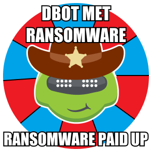

### There’s a New Texas Ranger in Town

Nefarious attackers coming in at you from all fronts. Ransomware, phishing, malware, cryptojacking...don’t you wish you could just go Texas Ranger on them? 

Well, now you can. Our latest DBot Truth Bombs content pack allows you to channel the man and the myth behind Walker, Texas Ranger - yeah, you know who we’re talking about - while you go about your daily business of annihilating your cyber enemies with our other Palo Alto Networks products. 
    

This Content Pack packs heat:
 - Automates the injection of humor at scale into your daily routine.
 - Energizes you with motivational affirmations when the going gets tough in the SOC.
 - Channels the awesomeness of the original Walker, Texas Ranger to supercharge your security operations.
 - Improves team morale and speeds MTTL (mean time to laughter).

Let’s see Siri or Alexa top that!  

Channel the power of positive posturing today.  Grab this content pack from our Cortex XSOAR Marketplace where you will find hundreds of content packs to help you automate and drastically reduce time spent handling your security incidents! 

Published as part of April fool's.