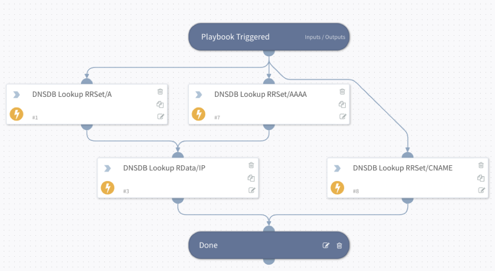
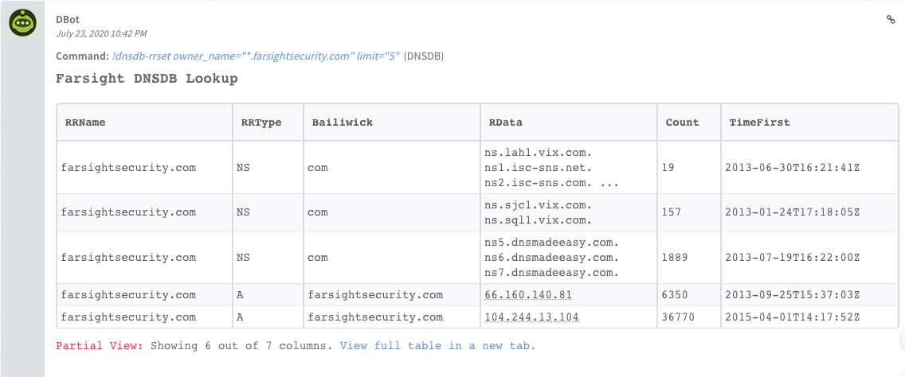

Increase Incident Response Speed and Accuracy with Cortex XSOAR and Farsight Security DNSDB®.

##### Overview
Farsight Security DNSDB® is the world’s largest DNS intelligence database that provides a unique, fact-based, multifaceted view of the configuration of the global Internet infrastructure. DNSDB leverages the richness of Farsight’s Security Information Exchange (SIE) data-sharing platform and is engineered and operated by leading DNS experts. Farsight collects Passive DNS data from its global sensor array. It then filters and verifies the DNS transactions before inserting them into the DNSDB, along with ICANN-sponsored zone file access download data. 

To measurably improve the speed and accuracy of incident response, security analysts need to uncover and gain context for all connected DNS-related digital artifacts, in seconds, using a comprehensive, intelligent search process. By leveraging the Cortex XSOAR Farsight DNSDB integration, security practitioners can automate critical tasks to gain actionable insights into existing threat indicators and avoid dead time by coordinating actions across security projects on a single console. Add to existing Cortex XSOAR workflows to auto generate the query and populate the contextual information for all IPs and domain names.

##### Integration Features:
- **IP Enrichment**: Enable the retrieval of hostnames that resolve to IP addresses to infer the reason the victim connected to a given IP address.
- **Hostname Enrichment**: Find all IPs that a hostname has been observed resolving to around the time of observation to identify flows to command-and-control systems that change their IP addresses to avoid detection.
- **Find Related Hostnames**: Find other hostnames that have resolved to the same IP address as the target hostname to expand on threat intelligence by identifying alternative command-and-control hostnames that may be using common infrastructure.
- **Interactive Investigations**: Use the DNSDB API via DBOT to automatically add the findings to an investigation. Perform advanced, interactive searches to aid investigations beyond the scope of provided playbooks.

##### Use Case #1: Automated Enrichment

**Challenge**: Incident response teams have visibility to DNS as it currently sits and can only resolve DNS from name-to-record.  They need a reliable reverse-resolution and DNS history and the ability to pivot from IP to name and vice versa to retrieve the totality of logs related to an incident. For example, teams want to retrieve net flows related to a hostname.

**Solution**: Farsight provides the playbooks that integrate into your incident response process. Employing the Farsight Hostname from IP, IPs from Hostname and Related Hostnames playbooks in Cortex automates the search. Teams can retrieve all hostnames seen for a given IP. Conversely, teams can retrieve all IPs for a given hostname or pivot to retrieve a limited number of other hostnames seen on the same IPs as the target hostname. These playbooks can be incorporated into your incident response pipeline for automated retrieval of relevant log data.

**Benefit**: Automated IP to Hostname queries reduces the time needed to respond to incursions and provide a comprehensive view of the attacker’s infrastructure. Automatic expansion and enrichment of search base saves time because all of data is assembled.

##### Use Case #2: Automated enhancement of interactive forensic investigations

**Challenge**: Time is of the essence when responding to an incident. Threat teams need to be able to expand investigations to move beyond the scope of standard playbooks to perform advanced searches.

**Solution**: Using the DNSDB API via DBOT, automatically adds the search findings to an investigation. This allows the user to perform advanced, interactive searches that will aid their investigation beyond the scope of provided playbooks.

**Benefit**: Increases the efficacy of other playbooks by automatically enriching the findings with real-time and historical DNS data.

##### About Farsight Security 

[Farsight Security®](https://farsightsecurity.com) is the world’s largest provider of historical and real-time Passive DNS data. We enable security teams to qualify, enrich and correlate all sources of threat data and ultimately save time when it is most critical - during an attack or investigation. Our solutions provide enterprise, government and security industry personnel and platforms with unmatched global visibility, context and response. Farsight Security is headquartered in San Mateo, California, USA. *Learn more about how we can empower your threat platform and security team with Farsight Security Passive DNS solutions at [farsightsecurity.com](https://farsightsecurity.com)*.
