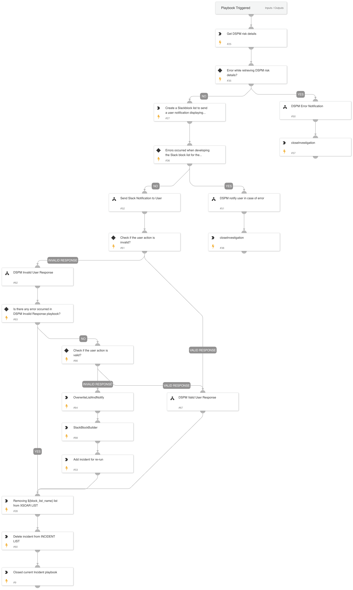

The playbook ensures efficient incident resolution and compliance with security policies by guiding the user through decision points based on incident type, such as empty storage assets or assets open to the world. It concludes by updating the incident status and closing the playbook upon resolution.

## Dependencies

This playbook uses the following sub-playbooks, integrations, and scripts.

### Sub-playbooks

* DSPM Valid User Response
* Send slack notificaton to user
* Invalid response sending notification to user again
* DSPM notify user in case of error

### Integrations

This playbook does not use any integrations.

### Scripts

* DSPMCreateSimpleSlackMessageBlock
* DSPMCheckAndSetErrorEntries
* IsIntegrationAvailable
* DSPMIncidentList
* DSPMExtractRiskDetails
* DeleteContext
* DSPMCreateRiskSlackBlocks
* isError
* SlackBlockBuilder

### Commands

* createList
* setList
* getList
* addToList
* closeInvestigation
* core-api-post

## Playbook Inputs

---

| **Name** | **Description** | **Default Value** | **Required** |
| --- | --- | --- | --- |
| defaultSlackUserName | In the event that the risk asset tag is absent, the risk notice will be sent to this Slack user email address. | dummy@mail.com | Required |
| slackMessageLifetime | Lifetime for slack notification \(in seconds\) | 300 | Optional |
| rerunTime | Incident re-run time \(in hours\) | 24 | Optional |

## Playbook Outputs

---
There are no outputs for this playbook.

## Playbook Image

---

