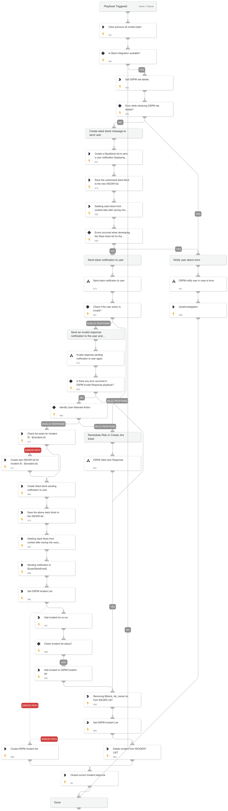

The playbook ensures efficient incident resolution and compliance with security policies by guiding the user through decision points based on incident type, such as empty storage assets or assets open to the world. It concludes by updating the incident status and closing the playbook upon resolution.

## Dependencies

This playbook uses the following sub-playbooks, integrations, and scripts.

### Sub-playbooks

* DSPM Invalid User Response
* DSPM notify user in case of error
* Send Slack Notification to User
* DSPM Valid User Response
* DSPM Error Notification

### Integrations

This playbook does not use any integrations.

### Scripts

* DSPMIncidentList
* DSPMCreateRiskSlackBlocks
* DSPMOverwriteListAndNotify
* DSPMCheckAndSetErrorEntries
* isError
* SlackBlockBuilder
* DSPMRemoveSlackBlockList
* DSPMExtractRiskDetails

### Commands

* closeInvestigation

## Playbook Inputs

---
There are no inputs for this playbook.

## Playbook Outputs

---
There are no outputs for this playbook.

## Playbook Image

---

