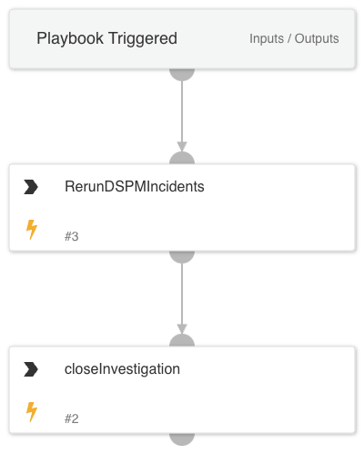

The "DSPM Re-run Incident" playbook is designed to automatically re-run DSPM incidents. It starts by executing the RerunDSPMIncidents task, which reinitiates the incidents for further investigation or processing. After completing this task, the playbook proceeds to close the current incident using the closeInvestigation script. This playbook ensures that DSPM incidents can be efficiently retried and closed upon completion.

## Dependencies

This playbook uses the following sub-playbooks, integrations, and scripts.

### Sub-playbooks

This playbook does not use any sub-playbooks.

### Integrations

This playbook does not use any integrations.

### Scripts

* DSPMRerunIncidents

### Commands

* closeInvestigation

## Playbook Inputs

---
There are no inputs for this playbook.

## Playbook Outputs

---
There are no outputs for this playbook.

## Playbook Image

---

