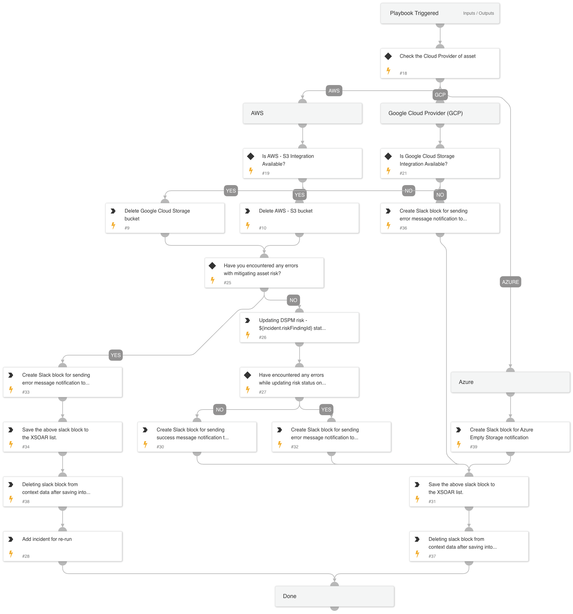

This playbook is designed to remediate risks associated with empty storage assets across AWS, Azure, and GCP environments. It identifies the cloud provider for the asset and proceeds to delete the storage container or bucket accordingly. Additionally, it sends notifications via Slack to inform stakeholders about the status of the remediation process.

## Dependencies

This playbook uses the following sub-playbooks, integrations, and scripts.

### Sub-playbooks

This playbook does not use any sub-playbooks.

### Integrations

* AWS - S3
* DSPM
* Google Cloud Storage

### Scripts

* IsIntegrationAvailable
* DSPMIncidentList
* DSPMCheckAndSetErrorEntries
* DeleteContext
* DSPMCreateSimpleSlackMessageBlock

### Commands

* aws-s3-delete-bucket
* dspm-update-risk-finding-status
* gcs-delete-bucket
* setList

## Playbook Inputs

---
There are no inputs for this playbook.

## Playbook Outputs

---
There are no outputs for this playbook.

## Playbook Image

---

