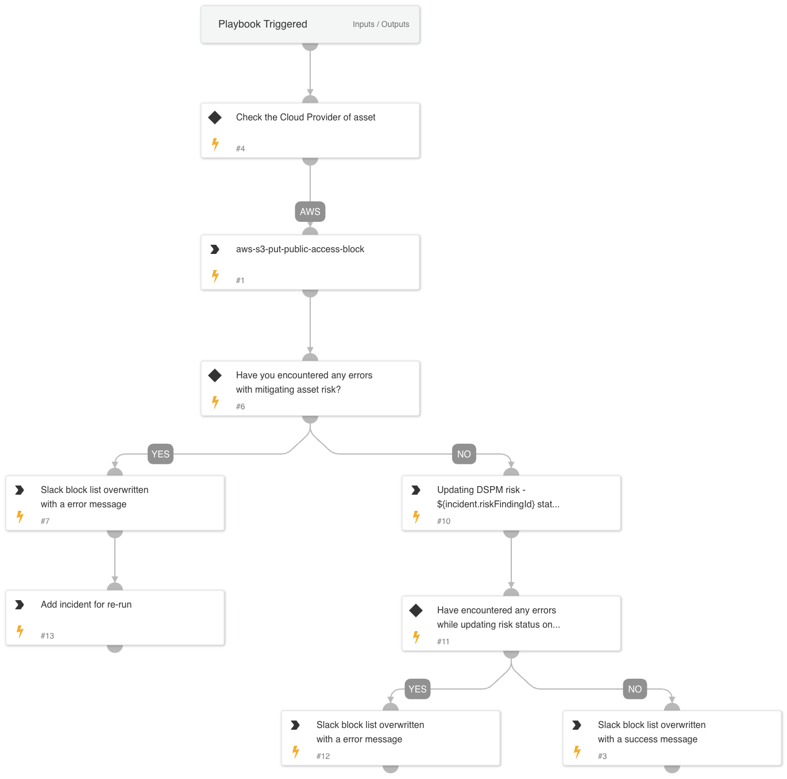

The DSPM Remediation Playbook for Sensitive Asset Open to World is designed to handle incidents where sensitive assets are exposed to the public, with specific focus on remediating this vulnerability across different cloud providers (AWS). Below is an overview of the key steps and actions included in this playbook:

## Dependencies

This playbook uses the following sub-playbooks, integrations, and scripts.

### Sub-playbooks

This playbook does not use any sub-playbooks.

### Integrations

* DSPM
* Google Cloud Storage
* AWS - S3
* Azure Storage Container

### Scripts

* DSPMIncidentList
* DSPMCreateSimpleSlackMessageBlock
* DSPMCheckAndSetErrorEntries
* DeleteContext
* DSPMGetContianers
* IsIntegrationAvailable

### Commands

* dspm-update-risk-finding-status
* setList
* aws-s3-put-public-access-block
* gcs-block-public-access-bucket
* azure-storage-container-block-public-access
* dspm-get-asset-files-by-id

## Playbook Inputs

---
There are no inputs for this playbook.

## Playbook Outputs

---
There are no outputs for this playbook.

## Playbook Image

---

