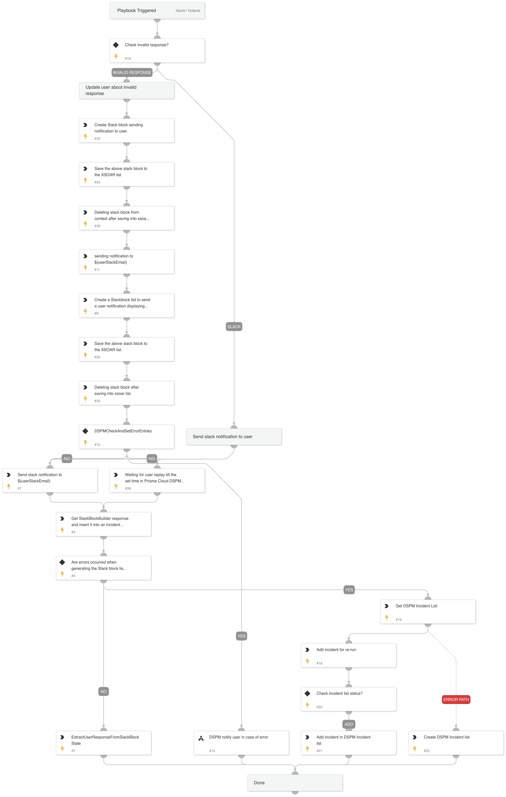

"Send Slack Notification to User" playbook is designed to notify a user via Slack and handle their response. It begins by sending a Slack notification to a specified email using the SlackBlockBuilder script. Afterward, it waits for the user's response until a predefined time, as configured in Prisma Cloud DSPM. Once the response is received, it is inserted into the incident's context. If there is an error in generating the Slack block, the incident is added for a re-run. Finally, the playbook extracts the user's response from the Slack block state for further processing.

## Dependencies

This playbook uses the following sub-playbooks, integrations, and scripts.

### Sub-playbooks

This playbook does not use any sub-playbooks.

### Integrations

This playbook does not use any integrations.

### Scripts

* DSPMWaitUntilUserSpecifiedTime
* DSPMExtractUserResponseFromSlackBlockState
* DSPMIncidentList
* GetSlackBlockBuilderResponse
* SlackBlockBuilder
* DSPMCheckAndSetErrorEntries

### Commands

This playbook does not use any commands.

## Playbook Inputs

---
There are no inputs for this playbook.

## Playbook Outputs

---
There are no outputs for this playbook.

## Playbook Image

---

