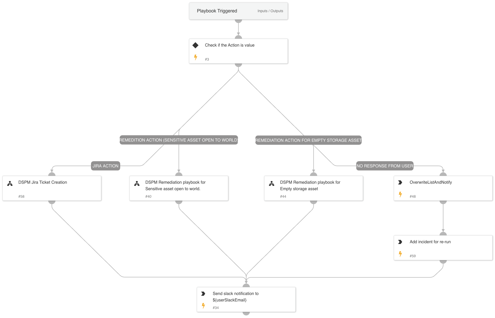

The DSPM Valid User Response playbook is designed to assess and manage user responses to DSPM-identified risks. It checks the user’s selected action (e.g., creating a Jira ticket or remediating specific risk types) and initiates the appropriate remediation or notification workflows. If no user response is received, the playbook logs the incident for future action, ensuring comprehensive tracking and response handling for DSPM incidents.

## Dependencies

This playbook uses the following sub-playbooks, integrations, and scripts.

### Sub-playbooks

* DSPM Remediation playbook for Sensitive asset open to world.
* DSPM Jira Ticket Creation
* DSPM Remediation playbook for Empty storage asset

### Integrations

This playbook does not use any integrations.

### Scripts

* SlackBlockBuilder
* IsIntegrationAvailable
* DSPMIncidentList
* DSPMCreateSimpleSlackMessageBlock
* DeleteContext

### Commands

* setList
* getList
* addToList
* createList

## Playbook Inputs

---

| **Name** | **Description** | **Default Value** | **Required** |
| --- | --- | --- | --- |
| rerunTime | Incident re-run time \(in hours\) |  | Optional |

## Playbook Outputs

---
There are no outputs for this playbook.

## Playbook Image

---

