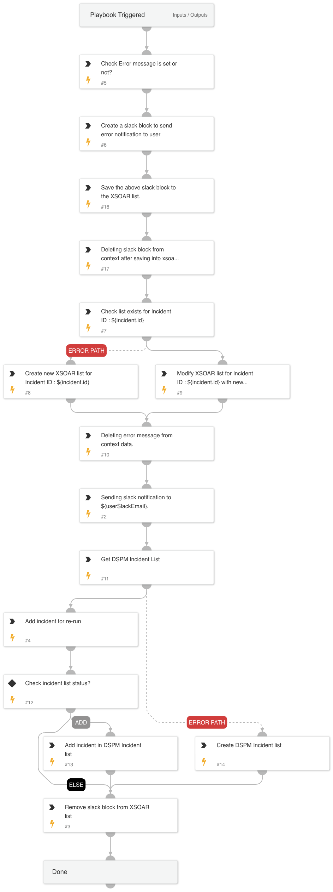

The DSPM Notify User in Case of Error playbook is designed to handle errors in DSPM incidents by notifying users and managing Slack notifications.

## Dependencies

This playbook uses the following sub-playbooks, integrations, and scripts.

### Sub-playbooks

This playbook does not use any sub-playbooks.

### Integrations

This playbook does not use any integrations.

### Scripts

* DSPMRemoveSlackBlockList
* DSPMIncidentList
* DSPMNotifyUser
* SlackBlockBuilder

### Commands

This playbook does not use any commands.

## Playbook Inputs

---
There are no inputs for this playbook.

## Playbook Outputs

---
There are no outputs for this playbook.

## Playbook Image

---

