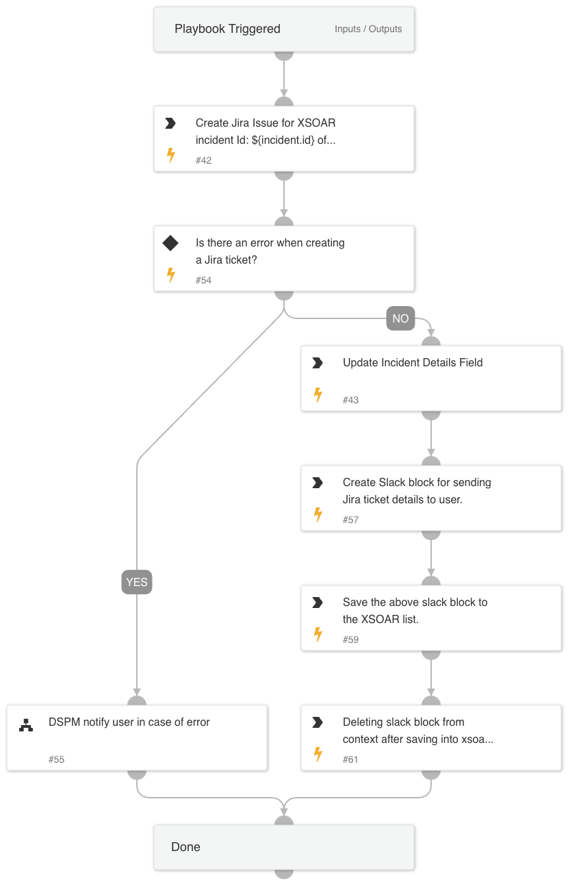

# DSPM Jira Ticket Creation

The **DSPM Jira Ticket Creation** is designed as a sub-playbook for Jira Ticket Creation, streamlining the process of creating a Jira ticket and providing immediate notification to the user with ticket details upon successful creation.

If an error occurs during ticket creation, the user receives a notification containing relevant incident details.

---

## Dependencies

This playbook uses the following sub-playbooks, integrations, and scripts:

### Sub-playbooks

- **DSPM notify user in case of error**

### Integrations

- **Prisma Cloud DSPM**
- **Slack V3 Pack**
- **Jira V3 Pack**

### Scripts

| **Script Name**                | **Description**                                                                                 |
| ------------------------------- | ------------------------------------------------------------------------------------------------- |
| DSPMOverwriteListAndNotify      | Overwrites a list's value and sends a Slack notification with Jira Ticket details.                |
| DSPMCheckAndSetErrorEntries     | Checks for error entries during Jira Ticket creation and sets errors in the XSOAR context.        |

### Commands

- **jira-create-issue**
- **setIncident**

---

## Playbook Inputs

| **Name**            | **Description**                                                                            | **Default Value** | **Required** |
|---------------------|--------------------------------------------------------------------------------------------|-------------------|--------------|
| issue_json          | The issue object (in JSON format).                                                          |                   | Optional     |
| summary             | The summary of the issue.                                                                   |                   | Required     |
| project_key         | The project key with which to associate the issue (Project Key or name is required).         |                   | Optional     |
| issue_type_name     | Selects an issue type by name, for example: "Problem".                                       |                   | Required     |
| issue_type_id       | Selects an issue type by its numeric ID (Issue type name or id is required).                 |                   | Optional     |
| project_name        | The project name with which to associate the issue (Project Key or name is required).        |                   | Required     |
| description         | A description of the issue.                                                                 |                   | Required     |
| labels              | A CSV list of labels.                                                                       |                   | Optional     |
| priority            | The priority of the issue, for example: High, Medium.                                        |                   | Optional     |
| due_date            | The due date for the issue (in the format yyyy-mm-dd).                                       |                   | Optional     |
| assignee            | The name of the assignee. Relevant for Jira Server only                                      |                   | Optional     |
| assignee_id         | The account ID of the assignee. Relevant for Jira Cloud only.                                |                   | Optional     |
| reporter_id         | The account ID of the reporter. Relevant for Jira Cloud only.                                |                   | Optional     |
| reporter            | The name of the reporter. Relevant for Jira Server only.                                     |                   | Optional     |
| parent_issue_key    | The parent issue key (if you're creating a sub-task).                                        |                   | Optional     |
| parent_issue_id     | The parent issue ID (if you're creating a sub-task).                                         |                   | Optional     |
| environment         | A text field for describing the environment in which the issue occurred.                     |                   | Optional     |
| security            | The security level of the issue. For example, security="Anyone".                             |                   | Optional     |
| components          | The component names of the issue.                                                           |                   | Optional     |
| details             | Slack Notification Message for Jira Ticket Details.                                          |                   | Required     |

---

## Playbook Outputs

| **Path** | **Description**           | **Type**   |
|----------|---------------------------|------------|
| Ticket   | Jira Ticket Information.   | unknown    |

---

## Scripts Description and Usage

### 1. **DSPMOverwriteListAndNotify**
   - **Description**: This script overwrites the value of a specified list and sends a Slack notification with the details of the Jira ticket.
   - **Usage**: 
     1. The script takes two inputs:
        - `list_name`: Name of the list to overwrite.
        - `message`: Notification message containing Jira ticket details.
     2. This script is triggered once the Jira ticket is successfully created.

### 2. **DSPMCheckAndSetErrorEntries**
   - **Description**: Checks for errors based on provided entry IDs during Jira ticket creation and sets the errors in the XSOAR context if found.
   - **Usage**:
     1. Input required:
        - `entry_id`: The ID of the last completed task entries to check for errors.
     2. The script returns "yes" if any errors are found, otherwise "no".
     3. If errors are found, it triggers a separate task to notify the user of the error.

---

## Step-by-Step Script Usage

1. **DSPM Jira Ticket Creation Playbook**
   - This playbook creates a Jira ticket by calling the `jira-create-issue` command with the provided inputs.
   - If an error occurs, the playbook uses **DSPMCheckAndSetErrorEntries** to verify the errors and notify the user via the **DSPMOverwriteListAndNotify** script.

2. **Notification on Success**
   - Once the Jira ticket is successfully created, the **DSPMOverwriteListAndNotify** script sends a Slack message to inform the user with details about the newly created ticket.

3. **Handling Errors**
   - In case of an error during the Jira ticket creation, **DSPMCheckAndSetErrorEntries** checks for errors, and the playbook triggers a notification with error details to the user.

---

## Playbook Image

