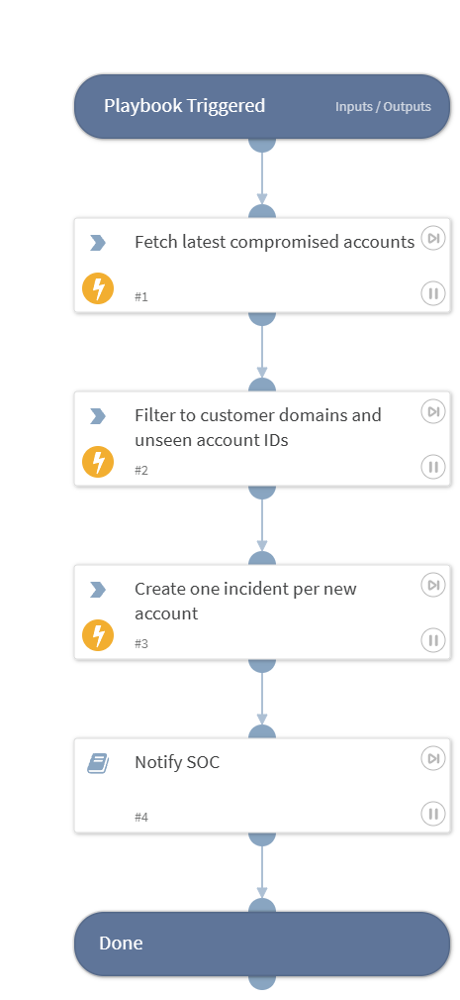

Polls Darkmon for compromised credentials, filters to the customer's email/web domains, dedupes via state list, and creates a 'Darkmon Compromised Credential' incident per new account. Triggered on a 4-hour Job.

## Dependencies

This playbook uses the following sub-playbooks, integrations, and scripts.

### Sub-playbooks

* Darkmon - Generic Notify

### Integrations

* Darkmon

### Scripts

* DarkmonCreateIncidents
* DarkmonFilterUnseen

### Commands

* dmontip-get-compromised

## Playbook Inputs

---
There are no inputs for this playbook.

## Playbook Outputs

---

| **Path** | **Description** | **Type** |
| --- | --- | --- |
| NewAccounts | Compromised account records that triggered new incidents this run. | unknown |
| Darkmon.Compromised.Account | Raw compromised account data returned by Darkmon. | unknown |

## Playbook Image

---

