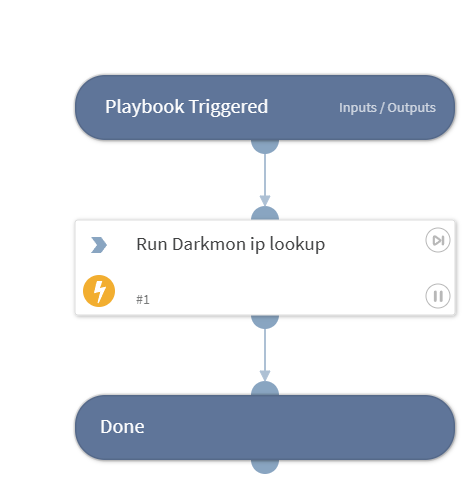

Sub-playbook that calls the Darkmon !ip command and returns DBotScore + Common.IP for the input IP indicator. Designed to be invoked from a parent playbook; does not auto-run on indicator creation.

## Dependencies

This playbook uses the following sub-playbooks, integrations, and scripts.

### Sub-playbooks

This playbook does not use any sub-playbooks.

### Integrations

* Darkmon

### Scripts

This playbook does not use any scripts.

### Commands

* ip

## Playbook Inputs

---

| **Name** | **Description** | **Default Value** | **Required** |
| --- | --- | --- | --- |
| IP | The IP indicator value to enrich. Defaults to $\{IP.Address\}. | IP.Address | Required |

## Playbook Outputs

---

| **Path** | **Description** | **Type** |
| --- | --- | --- |
| DBotScore.Indicator | The indicator value. | string |
| DBotScore.Type | The indicator type. | string |
| DBotScore.Vendor | The vendor reporting the score \(Darkmon\). | string |
| DBotScore.Score | The reputation score \(0=Unknown, 1=Good, 2=Suspicious, 3=Bad\). | number |
| DBotScore.Reliability | Source reliability per the Admiralty code. | string |
| IP.Address | The IP value. | string |
| IP.Malicious.Vendor | The vendor that flagged this IP as malicious \(Darkmon\). | string |
| IP.Malicious.Description | Reason this IP was flagged as malicious. | string |
| Darkmon.SearchResult | Full search result records returned by Darkmon for this indicator. | unknown |

## Playbook Image

---

