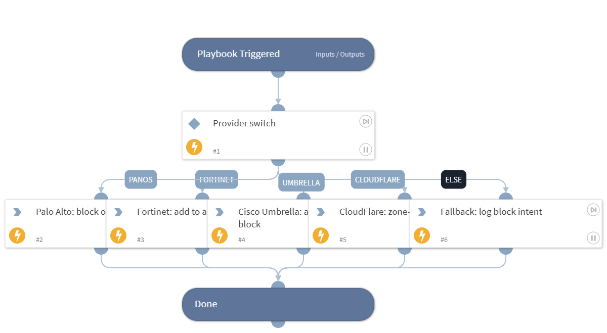

# Darkmon - Generic Block Indicator

Provider-agnostic indicator-block dispatcher. Reads the "Darkmon - Block Provider" List for the configured block target (`panos` | `fortinet` | `umbrella` | `cloudflare`) and routes to the matching command. Falls back to logging the block intent in the War Room when no provider is configured.

## Dependencies

This playbook uses the following sub-playbooks, integrations, and scripts.

### Sub-playbooks

This playbook does not use any sub-playbooks.

### Integrations

* Palo Alto Networks PAN-OS
* Fortinet FortiGate
* Cisco Umbrella
* Cloudflare

### Scripts

* PrintErrorEntry

### Commands

* pan-os-create-edl
* fortigate-create-address
* umbrella-add-destination
* cloudflare-block

## Playbook Inputs

| **Name** | **Description** | **Default Value** | **Required** |
| --- | --- | --- | --- |
| Indicator | The indicator value (IP, domain, URL) to block. |  | Required |
| Type | One of ip \| domain \| url. | ip | Optional |
| Reason | Free-text reason annotated on the block rule. | Darkmon flagged as malicious | Optional |

## Playbook Outputs

There are no outputs for this playbook.

## Playbook Image

---

