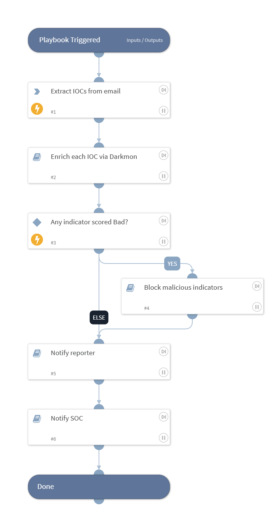

Extracts URLs/IPs/file-hashes from a reported phishing email, enriches each via the Darkmon - Enrich * sub-playbooks, and if any indicator is scored Bad (DBotScore=3) calls Generic Block Indicator on it. Notifies the reporter and the SOC at the end.

## Dependencies

This playbook uses the following sub-playbooks, integrations, and scripts.

### Sub-playbooks

* Block malicious indicators
* Enrich each IOC via Darkmon
* Notify SOC
* Notify reporter

### Integrations

This playbook does not use any integrations.

### Scripts

* ExtractIndicatorsFromTextFile

### Commands

This playbook does not use any commands.

## Playbook Inputs

---
There are no inputs for this playbook.

## Playbook Outputs

---

| **Path** | **Description** | **Type** |
| --- | --- | --- |
| ExtractedIndicators | IOCs extracted from the phishing email body. | unknown |
| DBotScore | Reputation scores from Darkmon enrichment per IOC. | unknown |

## Playbook Image

---

