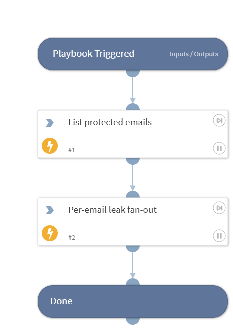

Hourly poll of board-protected emails. For each protected email, checks accounts/combo-lists/public-breaches and opens a 'Darkmon VIP Email Leak' incident per new entry.

## Dependencies

This playbook uses the following sub-playbooks, integrations, and scripts.

### Sub-playbooks

This playbook does not use any sub-playbooks.

### Integrations

* Darkmon

### Scripts

* DarkmonVIPFanOut

### Commands

* dmontip-get-boardprotection

## Playbook Inputs

---
There are no inputs for this playbook.

## Playbook Outputs

---

| **Path** | **Description** | **Type** |
| --- | --- | --- |
| Darkmon.BoardProtection | List of currently board-protected emails. | unknown |

## Playbook Image

---

