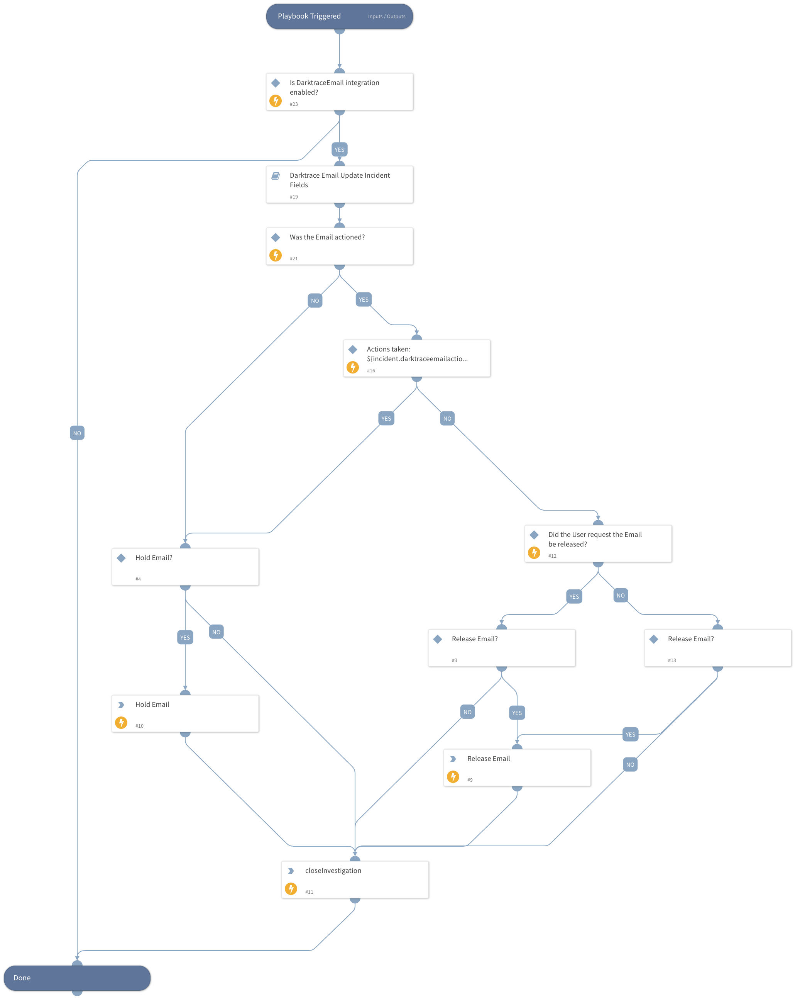

Runs a common Email workflow for fetch Darktrace Email incidents.

## Dependencies

This playbook uses the following sub-playbooks, integrations, and scripts.

### Sub-playbooks

* Darktrace Email Update Incident Fields

### Integrations

* DarktraceEmail

### Scripts

* IsTrue
* IsValueInArray

### Commands

* closeInvestigation
* darktrace-email-hold-email
* darktrace-email-release-email

## Playbook Inputs

---

| **Name** | **Description** | **Default Value** | **Required** |
| --- | --- | --- | --- |
| Incident ID |  | ${incident.id} | Required |

## Playbook Outputs

---
There are no outputs for this playbook.

## Playbook Image

---

