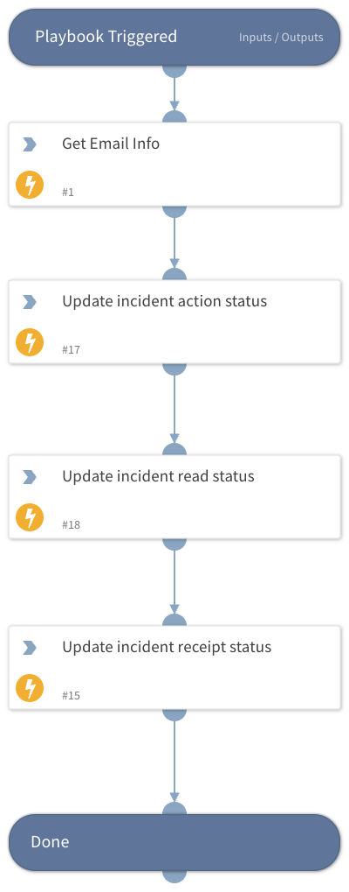

Update all incident fields that may change over time.

## Dependencies

This playbook uses the following sub-playbooks, integrations, and scripts.

### Sub-playbooks

This playbook does not use any sub-playbooks.

### Integrations

* DarktraceEmail_v1.0

### Scripts

This playbook does not use any scripts.

### Commands

* darktrace-email-get-email
* setIncident

## Playbook Inputs

---

| **Name** | **Description** | **Default Value** | **Required** |
| --- | --- | --- | --- |
| Incident ID |  | ${incident.id} | Required |

## Playbook Outputs

---
There are no outputs for this playbook.

## Playbook Image

---

