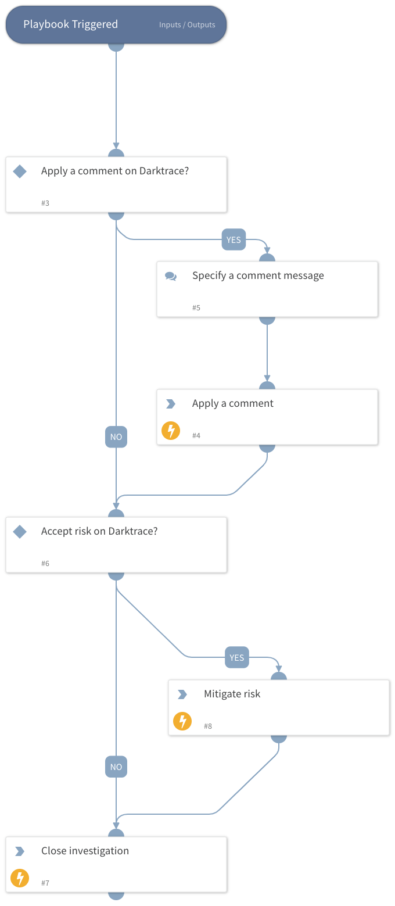

Handles each fetched Darktrace ASM Risk by offering the user the ability to take comment on Risks and Actions and actions on Risks from XSOAR to your Darktrace deployment.

## Dependencies

This playbook uses the following sub-playbooks, integrations, and scripts.

### Sub-playbooks

### Integrations

* DarktraceASM

### Scripts

### Commands

* darktrace-asm-post-comment
* darktrace-asm-mitigate-risk

## Playbook Inputs

---
There are no inputs for this playbook.

## Playbook Outputs

---
There are no outputs for this playbook.

## Playbook Image

---

