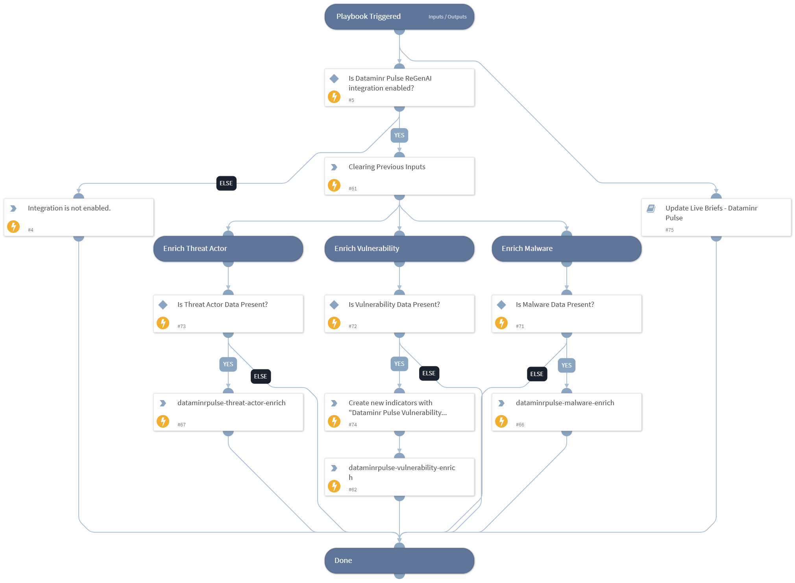

This playbook will enrich the Dataminr Pulse ReGenAI Incident's IOCs using custom reputation commands.

## Dependencies

This playbook uses the following sub-playbooks, integrations, and scripts.

### Sub-playbooks

* Update Live Briefs - Dataminr Pulse

### Integrations

This playbook does not use any integrations.

### Scripts

* DeleteContext
* Exists
* Print

### Commands

* createNewIndicator
* dataminrpulse-malware-enrich
* dataminrpulse-threat-actor-enrich
* dataminrpulse-vulnerability-enrich

## Playbook Inputs

---

| **Name** | **Description** | **Default Value** | **Required** |
| --- | --- | --- | --- |
| vulnerability_indicators | List of Vulnerability indicators. | incident.labels.vulnerability_indicators | Optional |
| malware_indicators | List of Malware indicators. | incident.labels.malware_indicators | Optional |
| threat_actors_indicators | List of threat actor indicators. | incident.labels.threat_actors_indicators | Optional |

## Playbook Outputs

---
There are no outputs for this playbook.

## Playbook Image

---

