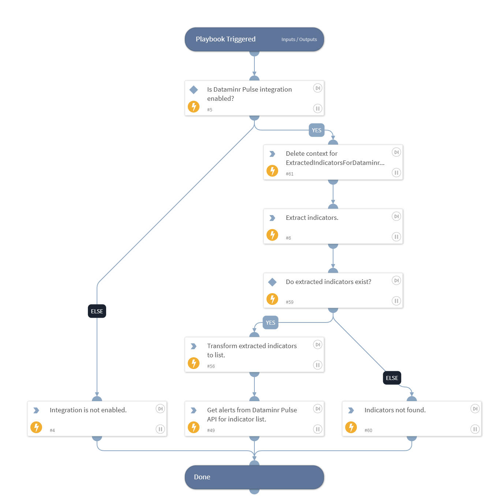

This playbook is used to fetch alerts from Dataminr Pulse, which will be based on the given input text. First, it will extract indicators from the input text, then it will use extracted indicators to retrieve alerts from Dataminr Pulse. After that, it will store related alerts in the context.

## Dependencies
This playbook uses the following sub-playbooks, integrations, and scripts.

## Permissions

### Sub-playbooks
This playbook does not use any sub-playbooks.

### Integrations
This playbook does not use any integrations.

### Scripts
* DeleteContext
* DataminrPulseTransformExtractedIndicatorsToList
* Print
* Exists

### Commands
* extractIndicators
* dataminrpulse-alerts-get

## Playbook Inputs
---

| **Name** | **Description** | **Default Value** | **Required** |
| --- | --- | --- | --- |
| text | Text to enrich \(default will be entire incident context\). | ${incident} | Optional |
| num | The number of alerts to retrieve. | 40 | Optional |
| use_configured_watchlist_names | A Boolean indicating that it should use configured watchlist names. Provide "yes " or "no" as value. Default will be "yes". | yes | Optional |

## Playbook Outputs
---
There are no outputs for this playbook.

## Playbook Image
---
