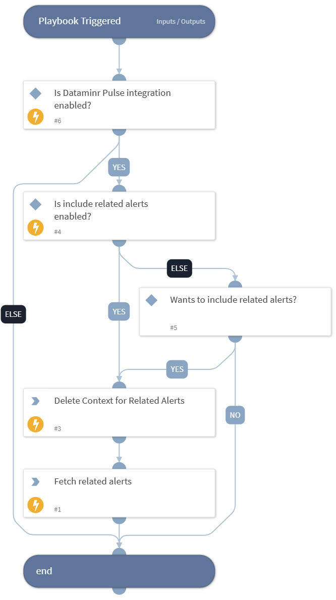

This playbook is used to run the Default playbook from XSOAR and to fetch related alerts for Dataminr Pulse. The information required to fetch related alerts will be used from the incident s alert ID for which the playbook is going to run. After that, it will store them in the context.

## Dependencies
This playbook uses the following sub-playbooks, integrations, and scripts.

### Sub-playbooks
This playbook does not use any sub-playbooks.

### Integrations
This playbook does not use any integrations.

### Scripts
* DeleteContext

### Commands
* dataminrpulse-related-alerts-get

## Playbook Inputs
---
There are no inputs for this playbook.

## Playbook Outputs
---
There are no outputs for this playbook.

## Playbook Image
---
