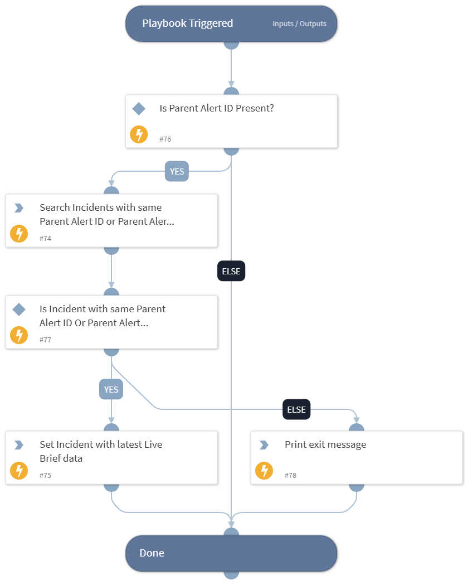

This playbook will update the previously fetched Dataminr Pulse ReGenAI incidents with the latest briefs.

## Dependencies

This playbook uses the following sub-playbooks, integrations, and scripts.

### Sub-playbooks

This playbook does not use any sub-playbooks.

### Integrations

This playbook does not use any integrations.

### Scripts

* Print
* SearchIncidentsV2

### Commands

* setIncident

## Playbook Inputs

---

| **Name** | **Description** | **Default Value** | **Required** |
| --- | --- | --- | --- |
| number_of_incidents_to_update | Provide the number of incidents you want to update with the latest Live Brief. | 100 | Optional |

## Playbook Outputs

---
There are no outputs for this playbook.

## Playbook Image

---

