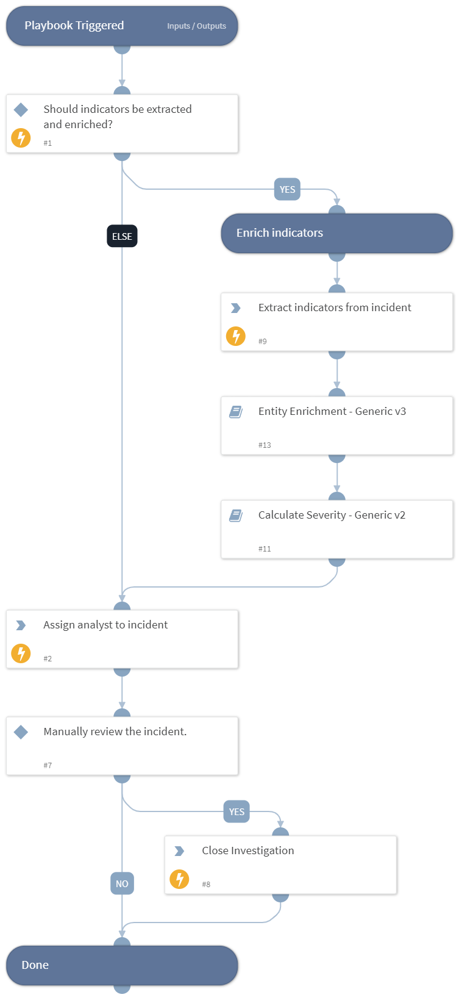

This playbook executes when no other playbook is associated with an incident. It performs the following actions:
- Extracts and enriches indicators in an incident using one or more integrations.
- Deduplicates by linking and closing similar incidents.
- Retrieves related files from endpoints using hash / file path.
- Hunts for occurrences of suspicious files in the organization's endpoints.
- Unzips zipped files, and extracts indicators from them.
- Detonates files and URLs in sandbox integrations.
- Calculates a severity for the incident.
- Allows the analyst to remediate the incident by blocking malicious indicators that were found.

## Dependencies

This playbook uses the following sub-playbooks, integrations, and scripts.

### Sub-playbooks

* Search Endpoints By Hash - Generic V2
* Block Indicators - Generic v3
* Entity Enrichment - Generic v3
* Get File Sample - Generic
* Extract Indicators From File - Generic v2
* Dedup - Generic v4
* Calculate Severity - Generic v2
* Detonate URL - Generic v1.5
* Detonate File - Generic

### Integrations

This playbook does not use any integrations.

### Scripts

* Set
* GenerateInvestigationSummaryReport

### Commands

* setIncident
* extractIndicators
* closeInvestigation

## Playbook Inputs

---

| **Name** | **Description** | **Default Value** | **Required** |
| --- | --- | --- | --- |
| ExtractIndicators | Determines whether indicators in this incident should be extracted manually. If you turned off Auto-extract for the current incident type, you may want to set this value to True. Otherwise, indicators from this incident will not be extracted, which will negatively affect the efficacy of the playbook. | True | Optional |

## Playbook Outputs

---
There are no outputs for this playbook.

## Playbook Image

---

