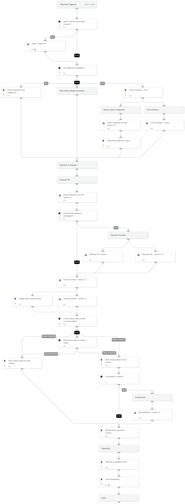

Sometimes you may have an incident, or just some data at hand, that does not fall into any specific category. When you simply create an incident from scratch or just want to get more information about an indicator without performing a full investigation, we recommend using our Default playbook.

This pack provides you with the Default playbook and layout, which help automate the core steps of every investigation.
The Default playbook automatically enriches indicators, parses files, detonates files and URLs, maps affected endpoints and calculates a severity for the incident.
The Default layout is a good match for any incident type, as it dynamically displays mapped or unmapped incident data, file attachments and assets and indicators.

The layout also features remediation buttons as well as a collection of utilities any analyst would love to have at hand.

##### What does this pack do?
- Extracts and enriches indicators in an incident using one or more integrations.
- Deduplicates by linking and closing similar incidents.
- Retrieves related files from endpoints using hash / file path.
- Hunts for occurrences of suspicious files in the organization's endpoints.
- Unzips zipped files, and extracts indicators from them.
- Detonates files and URLs in sandbox integrations.
- Calculates a severity for the incident.
- Allows the analyst to remediate the incident by blocking malicious indicators that were found.
- Gives the analyst an overview of incident data and additional data collected during the incident.
- Gives the analyst the ability to remediate the incident through the incident layout.
- Provides a "swiss army knife" of important tools every analyst needs.

The playbook found in this pack provides a great out-of-the-box solution, yet it can be customized should you want to add additional logic to the default behavior.

_For more information, visit our [Cortex XSOAR Reference Docs](https://xsoar.pan.dev/docs/reference/articles/the-default-pack)_

