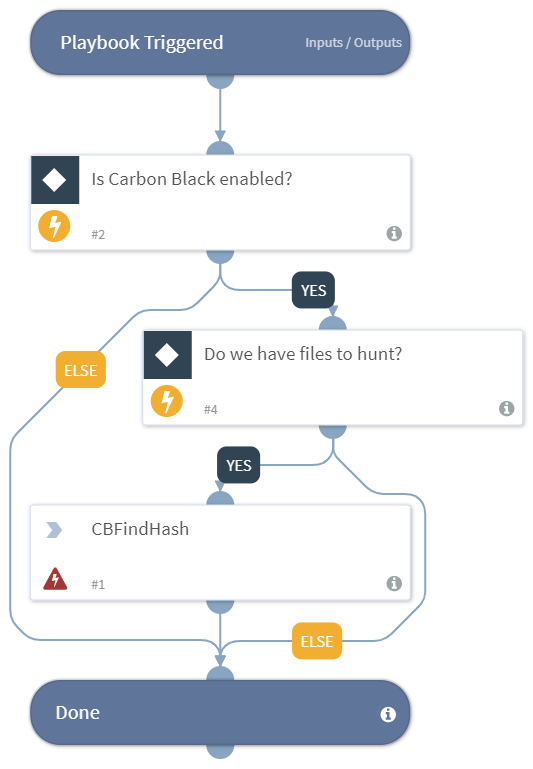

DEPRECATED. Use "Search Endpoints By Hash - Carbon Black Response V2" playbook instead. Hunts for malicious indicators using Carbon Black.

## Dependencies
This playbook uses the following sub-playbooks, integrations, and scripts.

## Sub-playbooks
This playbook does not use any sub-playbooks.

## Integrations
This playbook does not use any integrations.

## Scripts
* Exists
* CBFindHash

## Commands
This playbook does not use any commands.

## Playbook Inputs
---
There are no inputs for this playbook.

## Playbook Outputs
---
There are no outputs for this playbook.

## Playbook Image
---

