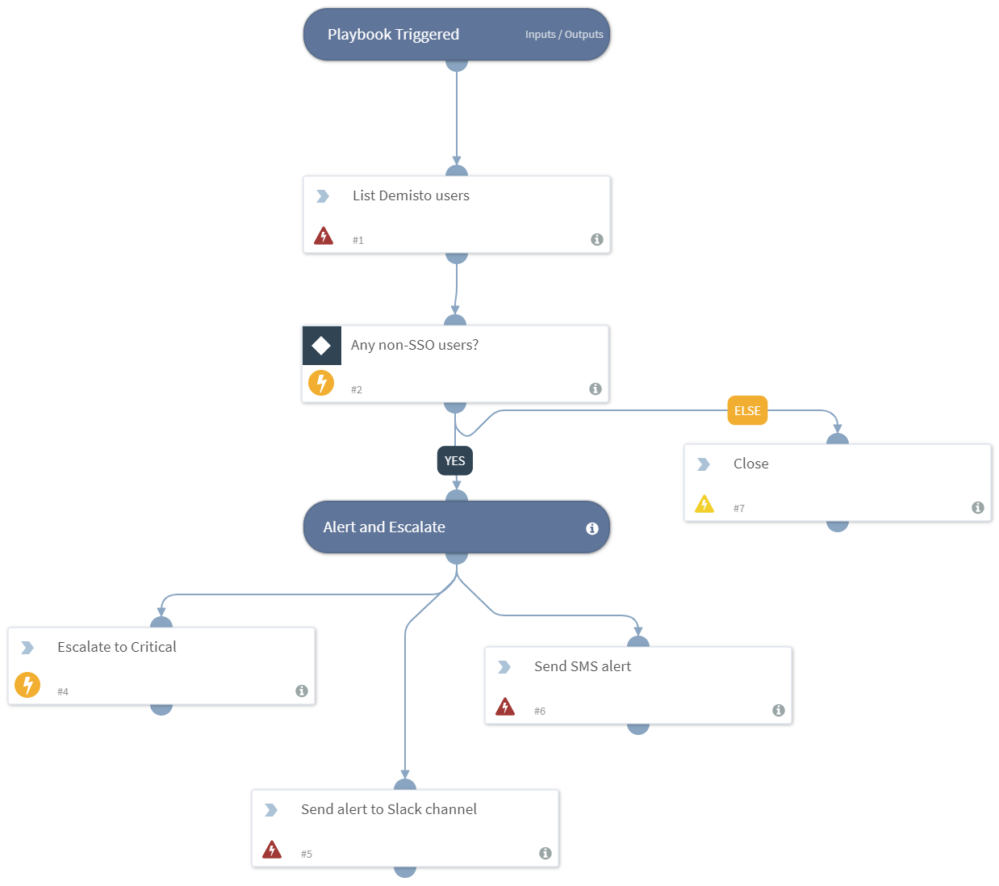

DEPRECATED. Gets a list of Demisto users through the REST API, and alerts you if any non-SAML user accounts are found.

## Dependencies
This playbook uses the following sub-playbooks, integrations, and scripts.

## Sub-playbooks
This playbook does not use any sub-playbooks.

## Integrations
* slack
* Demisto REST API
* Twilio
* Builtin

## Scripts
* CloseInvestigation

## Commands
* slack-send
* TwilioSendSMS
* setIncident
* demisto-api-get

## Playbook Inputs
---
There are no inputs for this playbook.

## Playbook Outputs
---
There are no outputs for this playbook.

## Playbook Image
---

