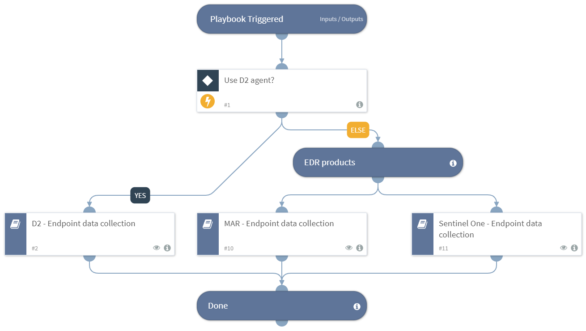

Deprecated. Collects data from endpoints for IR purposes. Will use whichever integrations are configured and available.

## Dependencies
This playbook uses the following sub-playbooks, integrations, and scripts.

### Sub-playbooks
* D2 - Endpoint data collection
* Sentinel One - Endpoint data collection
* MAR - Endpoint data collection

### Integrations
This playbook does not use any integrations.

### Scripts
* AreValuesEqual

### Commands
This playbook does not use any commands.

## Playbook Inputs
---

| **Name** | **Description** | **Default Value** | **Required** |
| --- | --- | --- | --- | 
| UseD2 |  | False | Optional |
| Hostname |  | - | Optional |

## Playbook Outputs
---
There are no outputs for this playbook.

## Playbook Image
---

