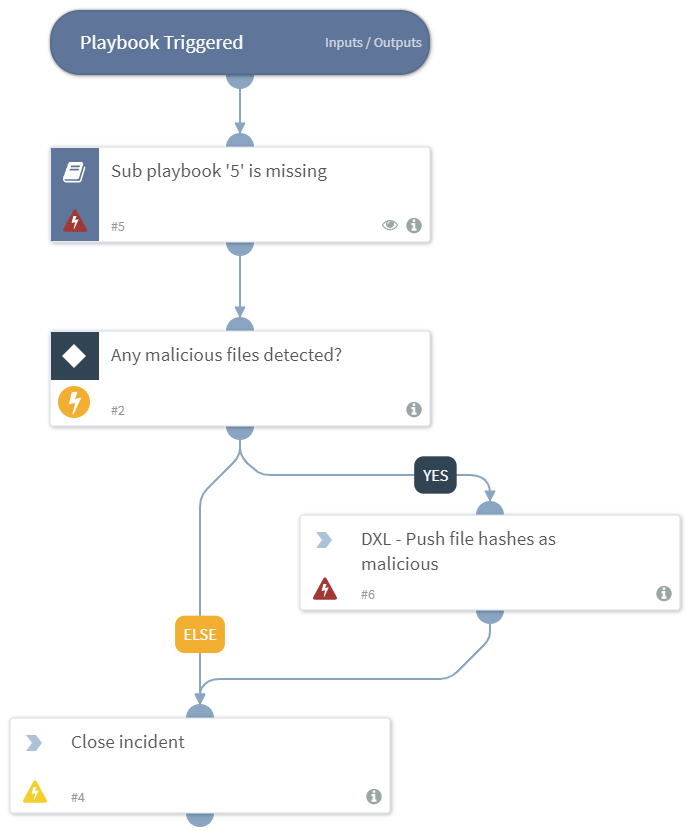

DEPRECATED. Use "Enrich DXL with ATD verdict v2" playbook instead. Detonates a file in ATD and if malicious, pushes its MD5, SHA1 and SHA256 hashes to McAfee DXL. An example of using McAfee ATD and pushing any malicious verdicts over DXL.

## Dependencies
This playbook uses the following sub-playbooks, integrations, and scripts.

### Sub-playbooks
This playbook does not use any sub-playbooks.

### Integrations
* McAfee DXL

### Scripts
* CloseInvestigation
* Exists

### Commands
* dxl-send-event

## Playbook Inputs
---
There are no inputs for this playbook.

## Playbook Outputs
---
There are no outputs for this playbook.

## Playbook Image
---

