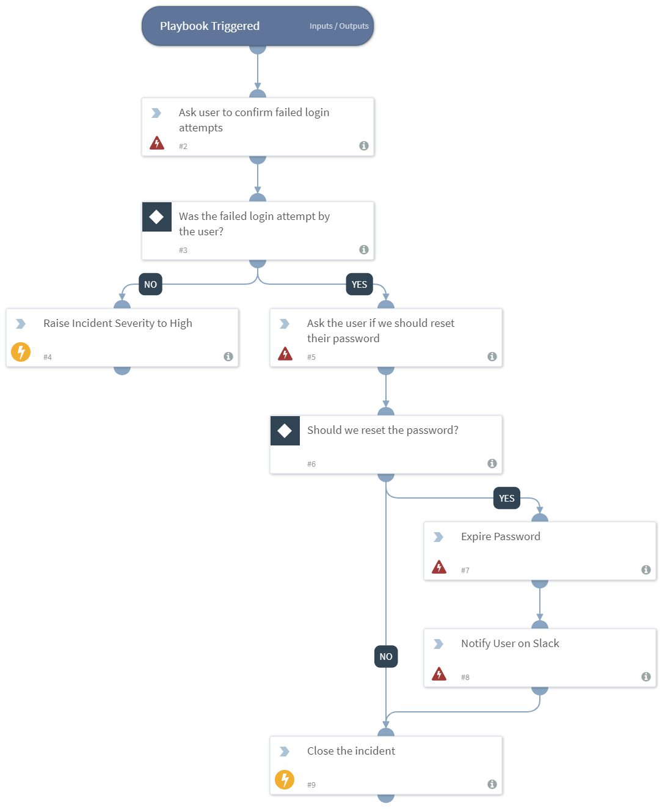

Deprecated. When there are three failed login attempts to Cortex XSOAR that originate from the same user ID, a direct message is sent to the user on Slack requesting that they confirm the activity. If the reply is "no", then the incident severity is set to "high". If the reply is "yes", then another direct message is sent to the user asking if they require a password reset in AD. 

## Dependencies
This playbook uses the following sub-playbooks, integrations, and scripts.

### Sub-playbooks
This playbook does not use any sub-playbooks.

### Integrations
* Builtin

### Scripts
* SlackAsk

### Commands
* ad-expire-password
* closeInvestigation
* send-notification
* setIncident

## Playbook Inputs
---
There are no inputs for this playbook.

## Playbook Outputs
---
There are no outputs for this playbook.

## Playbook Image
---

