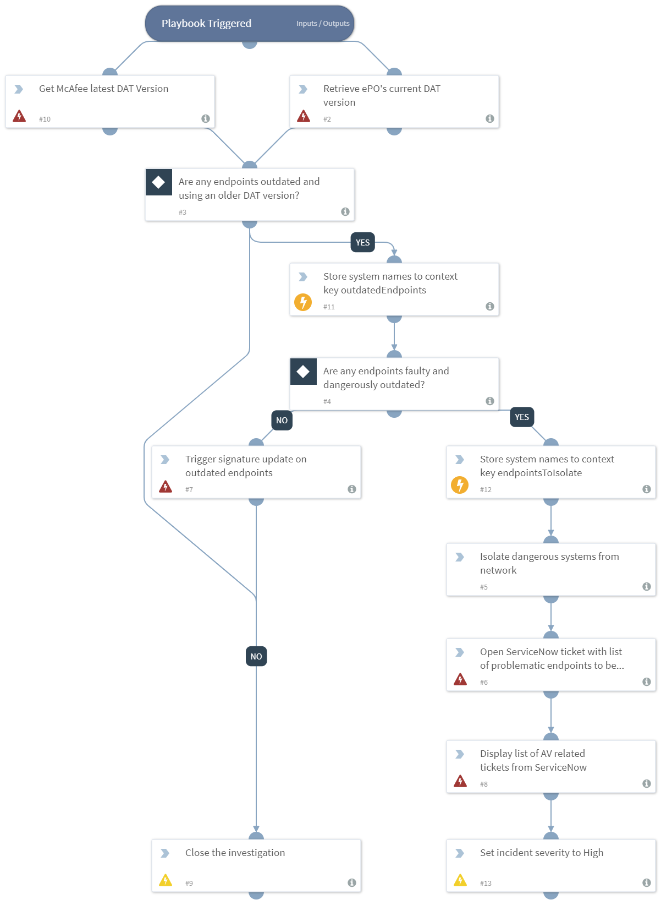

DEPRECATED. Use "McAfee ePO Endpoint Compliance Playbook v2" playbook instead. Discovers endpoints that are not using the latest McAfee AV Signatures.

## Dependencies
This playbook uses the following sub-playbooks, integrations, and scripts.

### Sub-playbooks
This playbook does not use any sub-playbooks.

### Integrations
* ServiceNow
* epo

### Scripts
* CloseInvestigation
* commentsToContext
* IncidentSet

### Commands
* servicenow-incidents-query
* epo-update-client-dat
* servicenow-incident-create
* epo-get-current-dat
* epo-get-latest-dat

## Playbook Inputs
---
There are no inputs for this playbook.

## Playbook Outputs
---
There are no outputs for this playbook.

## Playbook Image
---

