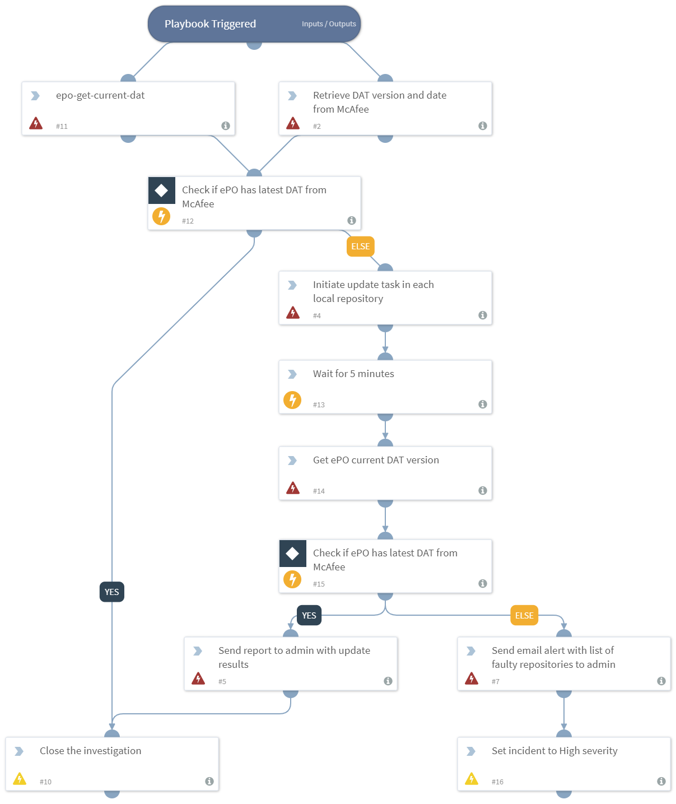

DEPRECATED. Use "McAfee ePO Repository Compliance Playbook v2" playbook instead. Ensures that ePO servers are updated to the latest McAfee published AV signatures (DAT file version). 

## Dependencies
This playbook uses the following sub-playbooks, integrations, and scripts.

### Sub-playbooks
This playbook does not use any sub-playbooks.

### Integrations
* epo

### Scripts
* CloseInvestigation
* SendEmail
* Sleep
* IncidentSet
* AreValuesEqual

### Commands
* epo-get-current-dat
* epo-get-latest-dat
* epo-update-repository

## Playbook Inputs
---
There are no inputs for this playbook.

## Playbook Outputs
---
There are no outputs for this playbook.

## Playbook Image
---

