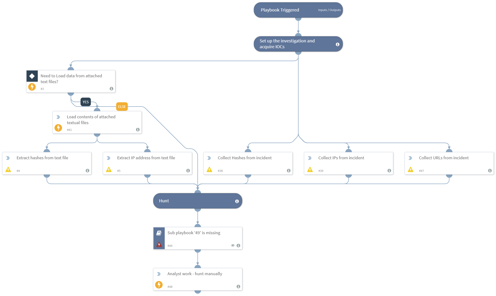

DEPRECATED. Use the Hunt File Hash playbook instead. Receives a list of IOCs as attached text or CSV files, extracts IOCs using regular expressions and hunts rapidly across the infrastructure using various integrations. This playbok reacts quickly to the discovery of new IOCs. This also supports attaching multiple files.

## Dependencies
This playbook uses the following sub-playbooks, integrations, and scripts.

### Sub-playbooks
This playbook does not use any sub-playbooks.

### Integrations
This playbook does not use any integrations.

### Scripts
* ExtractIP
* ExtractHash
* Print
* ExtractURL
* ReadFile
* Exists

### Commands
This playbook does not use any commands.

## Playbook Inputs
---
There are no inputs for this playbook.

## Playbook Outputs
---
There are no outputs for this playbook.

## Playbook Image
---

