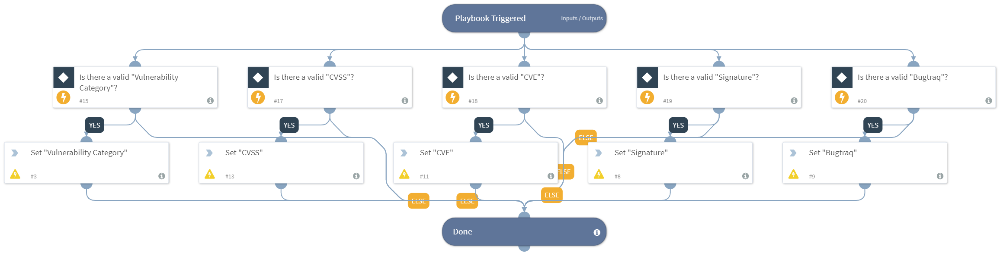

Deprecated. Adds information about the vulnerability and asset from the `Vulnerability Handling - Qualys` playbook data to the default "Vulnerability" layout.

## Dependencies
This playbook uses the following sub-playbooks, integrations, and scripts.

### Sub-playbooks
This playbook does not use any sub-playbooks.

### Integrations
This playbook does not use any integrations.

### Scripts
* IncidentSet

### Commands
This playbook does not use any commands.

## Playbook Inputs
---

| **Name** | **Description** | **Default Value** | **Source** | **Required** |
| --- | --- | --- | --- | --- |
| Qualys | The Qualys object containing the vulnerability data. | None | Qualys | Optional |
| CVE | The CVE object containing the vulnerability data. | None | CVE | Optional |

## Playbook Outputs
---
There are no outputs for this playbook.
## Playbook Image
---

